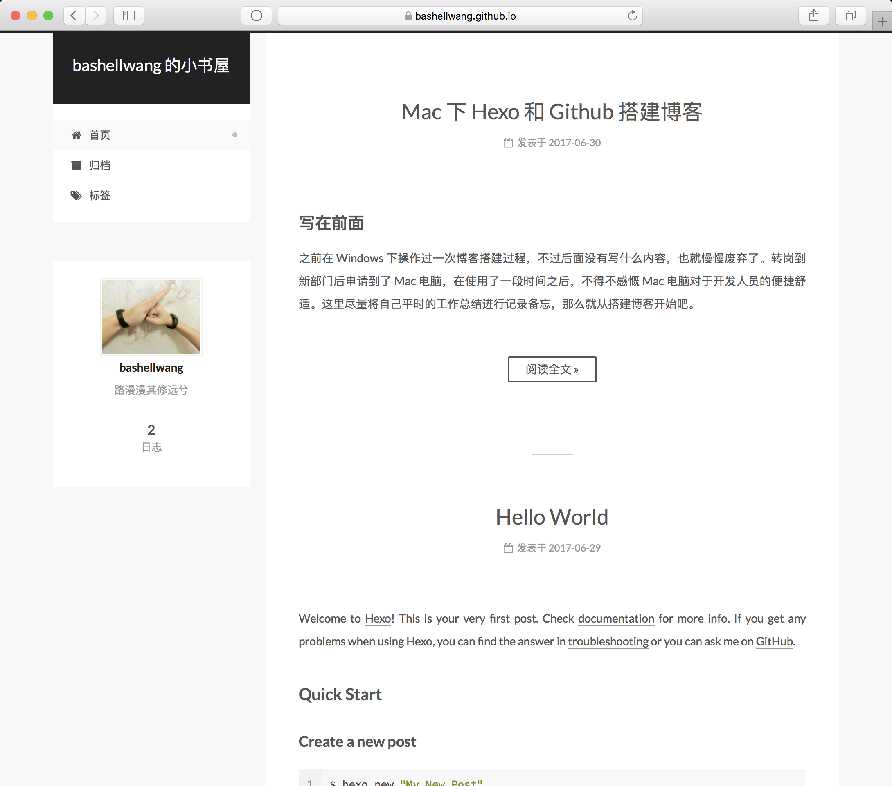

### 写在前面

之前在 Windows 下操作过一次博客搭建过程，不过后面没有写什么内容，也就慢慢废弃了。转岗到新部门后申请到了 Mac 电脑，在使用了一段时间之后，不得不感慨 Mac 电脑对于开发人员的便捷舒适。这里尽量将自己平时的工作总结进行记录备忘，那么就从搭建博客开始吧。

### 注册 GitHub 账号

在 [Github](https://github.com/) 上进行注册，这个比较简单，按照正常操作即可。

创建仓库 (repo)，这个仓库是和我们的博客关联起来的，后续博客文章资源都是存放在这个仓库当中。使用 Hexo 时，repo 的名字应该按照 `your_github_username.github.io` 来命名。一个账号一般只能对应一个博客。

<!-- more -->

### 安装 Git、Node.js 和 Hexo

- Mac 电脑本身自带 Git ，无需安装
- 在 [Nodejs](https://nodejs.org/en/) 官网下载安装；用来下载 Hexo 等工具及插件
- 在命令行使用 `npm install -g hexo-cli` 来下载安装 Hexo

**注意：**

- 公司开发网需要设置代理 `npm config set proxy=http://dev-proxy.oa.com:8080`
- 如果发现没有权限，则使用如下命令 `sudo npm install -g hexo-cli`

### 搭建博客

#### 博客初始化

建立一个博客文件夹，比如 “GitRoom”，进入到文件夹后进行初始化操作

```
$ cd GitRoom
$ hexo init
```
安装依赖包

```
$ npm install
```
这样设置后，我们就可以在博客文件夹中看到多了很多文件和目录

### 博客配置

博客站点的配置信息在 `_config.yml` 文件中，我们主要修改如下几点即可（注意每一项的「 : 」后需要保留一个空格）

网站基本信息

```
title: bashellwang 的小书屋
subtitle:
description: 路漫漫其修远兮
author: bashellwang
language: zh-Hans
timezone: Asia/Shanghai
```

绑定 Github

```
deploy:
  type: git
  repo: https://github.com/bashellwang/bashellwang.github.io.git
  branch: master
```

### 博客本地部署测试

一般我们在发布到正式环境前会先本地部署看看效果，使用如下命令：

```
$ hexo server
```

此时，正常情况下应该会显示如下；在浏览器中输入 `http://localhost:4000/` 即可看到搭建好的博客和文章了。

### 博客发布到正式环境

```
$ npm install hexo-deployer-git --save
$ hexo deploy
```
这时我们就可以在 GitHub 的仓库中看见我们提交的网站相关资源了；此时在浏览器中输入 `your_github_name.github.io` 就可以打开我们博客的主页了。

### 新建文章

```
$ hexo new "article_title"
```
即可在本地文件夹 `/source/_post` 下看到我们新建的 markdown 文件；
使用 markdown 编辑器编写文章内容后保存（ mac 推荐使用 MacDown 软件）；
生成静态网页文件并发布到网上

```
$ hexo generate
$ hexo deploy
```
更多 Hexo 操作请参考 [Hexo 操作指南](https://hexo.io/zh-cn/docs/)

### 删除文章
在本地文件夹 `/source/_post` 目录下删除对应的 .md 文件，然后重新生成静态网页文件并发布

```
$ hexo generate
$ hexo deploy
```
每次当博客发生问题或错误时，建议先进行 clean 操作并重新生成静态网页

```
$ hexo clean
$ hexo g
```

### 草稿相关命令操作

#### 编写草稿
```
$ hexo new draft "article_title"
```
生成的文件作为草稿被放到 `/source/_draft` 目录下。

放在该目录下的草稿，在使用 `hexo generate` 命令生成静态文件时不会被处理。

#### 预览草稿
如果想要查看草稿效果，可以在启动本地服务时增加一个参数 `hexo server --draft`，或者在 `_config.yml` 文件中进行配置，这样每次在启动本地服务时都会渲染草稿。

```
render_drafts: true
```

#### 发布草稿
编写好草稿之后，如果想将草稿发布到 `source_posts` 目录下，可以使用如下命令：

```
$ hexo publish post "article_title"
```
在发布成功后，`_drafts` 目录下的草稿会被移除


### Hexo 常用命令

```
hexo help #查看帮助
hexo init #初始化一个目录
hexo new "postName" #新建文章
hexo new page "pageName" #新建页面
hexo generate #生成网页，可以在 public 目录查看整个网站的文件
hexo server #本地预览，'Ctrl+C'关闭
hexo deploy #部署.deploy目录
hexo clean #清除缓存，**强烈建议每次执行命令前先清理缓存，每次部署前先删除 .deploy 文件夹**
简写：
hexo n == hexo new
hexo g == hexo generate
hexo s == hexo server
hexo d == hexo deploy
```

### 博客主题修改
Hexo 支持多种主题，并且可以轻易修改主题风格。下面以我的站点 [https://bashellwang.github.io/](https://bashellwang.github.io/) 来进行简单说明
Hexo 主要有两份配置文件（文件名均为 `_config.yml`）：一份在站点根目录下，一份在主题 `theme` 目录下，我们可以分别称为站点配置文件和主题配置文件。

在 `theme` 目录下下载主题

```
$ git clone https://github.com/iissnan/hexo-theme-next themes/next
```

站点配置文件中启用主题

```
theme: next
```

主题配置文件中选用主题特性，使用 `Pisces` 特性

```
#scheme: Muse
#scheme: Mist
scheme: Pisces
```
这样即完成了基本的网站主题设置，更多详情请参考 [NexT 使用文档](http://theme-next.iissnan.com/getting-started.html)

### 博客中插入图片

可参考文章 [hexo 博客插入图片](https://univer2012.github.io/2017/04/23/6how-to-insert-picture-in-hexo-blog/)

### 最终成品

https://bashellwang.github.io/

