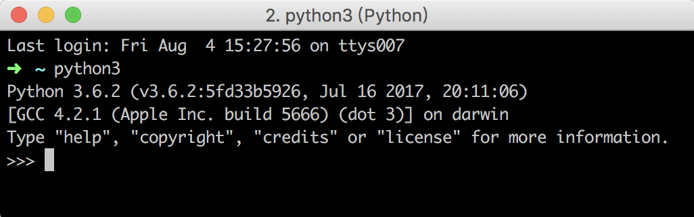

> 前言 ：人生苦短，我用 Python

### 概述

`Python` 是目前最为火热的脚本语言之一，它 “优雅、明确、简单”，被应用于后台服务，网站 Web，数据分析，机器学习等方方面面。作为一个 Android 开发人员，也是很有必要掌握一门第二语言，这里就记录下我的 Python 学习之路，主要学习[廖雪峰的 Python 教程](https://www.liaoxuefeng.com/wiki/0014316089557264a6b348958f449949df42a6d3a2e542c000)。

### Python 安装

Python 是跨平台的，可以运行于 Windows、Mac 和各种 Linux／Unix 系统上。目前 Python 有两个版本，一个是 2.x 版，一个是 3.x 版，可气的是 3.x 版本居然不向前兼容 2.x 版本；由于目前 3.x 版本越来越普及， 我们就以 Python 3.x 版本开始学习吧。

<!-- more -->

#### Mac 安装 Python

我的 Mac 版本号是 10.12.5，系统自带 Python 2.7，因此我们需要安装 Python 3.x 版本。

- [Python 官网](https://www.python.org/) 下载最新版本，双击安装即可
- 如果安装了 `Homebrew`，直接通过命令 `brew install python3` 安装即可

#### 运行 Python

在命令行中输入 `python3` 即可看到如下信息，说明我们安装成功。前面不是说系统有自带 Python 2.7 版本吗，在命令行中输入 python 即可使用 2.7 版本。



看到如上图所示的系统提示符 >>>，说明已经进入 Python 运行环境，在这里即可开始进行程序的编辑及运行。退出 Python 运行环境也很简单，直接命令行输入 exit() 即可。

### 第一个 Python 程序

#### Python 交互式环境

在交互式环境提示符 `>>>` 下，使用 `print()` 函数输出指定字符串，字符串使用单引号或双引号均可，但是不能混用单双引号。交互式模式相当于启动了 Python 解释器，等待一行行的代码输入并一行行执行。

```
>>> print('Hello Python!')
Hello Python!
```

#### 命令行模式

新建文件 `hello.py` ，将上述内容写入后保存，打开命令行，输入 `python3 hello.py` 即可得到输出结果。这种模式相当于启动解释器，一次性将源代码读取执行了，用户不能向交互式模式那样输入源码。

```
➜  Desktop python3 hello.py
Hello Python!
```

#### 文本编辑器
在交互模式下，可以一下子就得到结果，但是没法保存程序，每次运行时都需要重新输入一遍。因此我们一般都是把程序保存成 `.py` 格式的文件，后续就可以反复使用运行了。

编辑器使用 `Sublime Text` 或 `Nodepad++` 等市面上常见的编辑器均可，但是千万不要使用 Word 和 Windows 系统自带的记事本编辑。

#### 直接运行 Python 文件
如果你想在 Mac 下直接运行 Python 文件，那么只需要在 .py 文件的第一行加上如下特殊解释

```
#!/user/bin/env python3
print('Hello Python!')
```
然后，给文件添加执行权限

```
chmod a+x hello.py
```
即可直接在命令行运行该文件了

```
./hello.py
```

ok，到现在为止，我们已经安装了 Python 开发环境、开发了第一个 Python 程序，怎么样，是不是感觉比较简单呢。我们下一篇将开始进行 Python 的语法学习！
