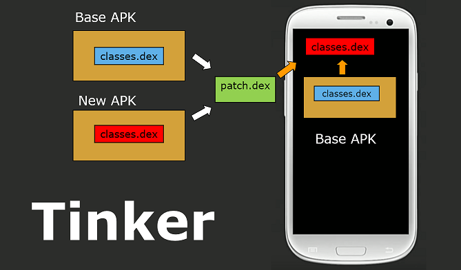
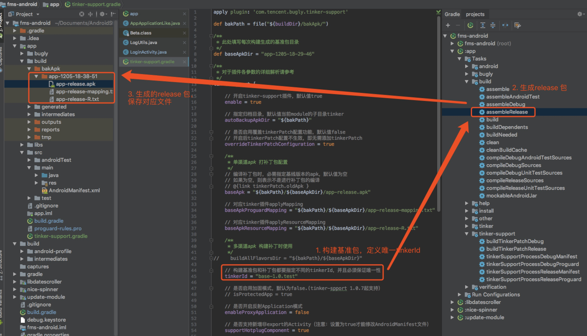
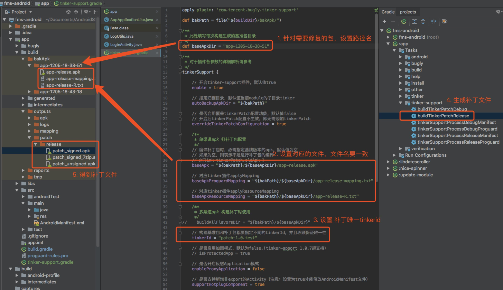
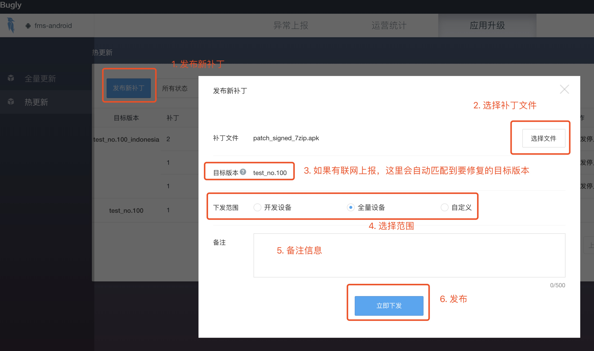
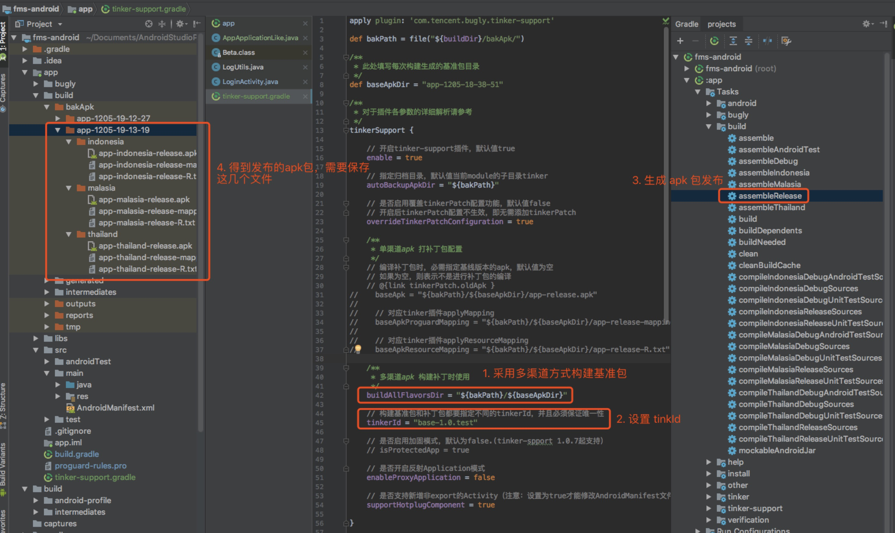
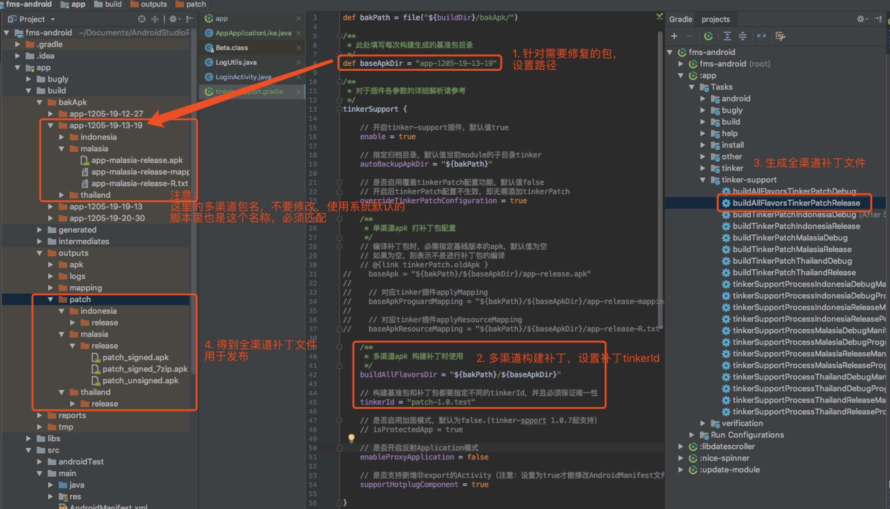
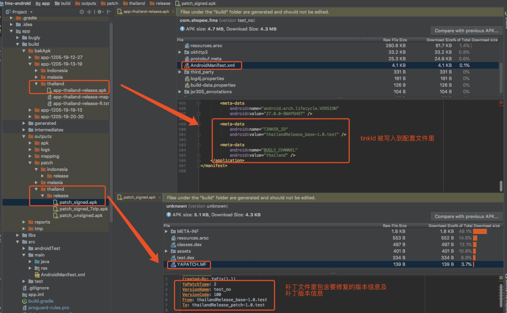

## APP 接入 Bugly 热更新

> 公司最近项目在考虑加入热更新能力，综合目前开源的多个项目方案，我们采取了基于 Tinker 封装的 Bugly 热更新解决方案。

Tinker 原理用官方的一张图展示



<!-- more -->

### Bugly 介绍
 
Bugly 热更新能力目前采用微信 Tinker 开源方案，无需重新发版即可解决线上问题，同时 Bugly 提供热更新管理后台免费给开发者使用。

下面是 Bugly 官方给出的一些优势，可参考 [Bugly Android 热更新指南](https://bugly.qq.com/docs/user-guide/instruction-manual-android-hotfix/?v=20181014122344) :

- 无需关注Tinker是如何合成补丁的
- 无需自己搭建补丁管理后台
- 无需考虑后台下发补丁策略的任何事情
- 无需考虑补丁下载合成的时机，处理后台下发的策略
- 提供了更加方便集成Tinker的方式
- 通过HTTPS及签名校验等机制保障补丁下发的安全性
- 丰富的下发维度控制，有效控制补丁影响范围
- 提供了应用升级一站式解决方案

### Bugly 接入

#### 第一步：添加依赖

工程根目录下 `build.gradle` 里添加

```
buildscript {
    repositories {
        google()
        jcenter()
    }
    dependencies {
        ...
        classpath "com.tencent.bugly:tinker-support:1.1.5"
        ...
    }
}
```

#### 第二步：集成 SDK

在 app module 下的 `build.gradle` 文件中添加

```
android {
    ...
    // recommend
    dexOptions {
        jumboMode = true
    }
    defaultConfig {
        ...
        ndk {
            // 设置支持的SO库架构
            abiFilters 'arm64-v8a', 'x86', 'armeabi-v7a', 'x86_64'
        }
        // 开启multidex
        multiDexEnabled true
    }
}
dependencies {
    ...
    compile "com.android.support:multidex:1.0.1" // 多dex配置
    compile 'com.tencent.bugly:crashreport_upgrade:1.3.6'
    compile 'com.tencent.tinker:tinker-android-lib:1.9.9'
    compile 'com.tencent.bugly:nativecrashreport:latest.release'
}

// 依赖插件脚本
apply from: 'tinker-support.gradle'
```

上面最后一行是将 tinker 相关的配置单独抽离出来，便于我们单独统一管理。我们在同级目录下新建 `tinker-support.gradle` 文件，内容如下：

```
apply plugin: 'com.tencent.bugly.tinker-support'

def bakPath = file("${buildDir}/bakApk/")

/**
 * 此处填写每次构建生成的基准包目录
 */
def baseApkDir = "app-1205-11-28-48"

/**
 * 对于插件各参数的详细解析请参考
 */
tinkerSupport {

    // 开启tinker-support插件，默认值true
    enable = true

    // 指定归档目录，默认值当前module的子目录tinker
    autoBackupApkDir = "${bakPath}"

    // 是否启用覆盖tinkerPatch配置功能，默认值false
    // 开启后tinkerPatch配置不生效，即无需添加tinkerPatch
    overrideTinkerPatchConfiguration = true

    /**
     * 单渠道apk 打补丁包配置
     */
    // 编译补丁包时，必需指定基线版本的apk，默认值为空
    // 如果为空，则表示不是进行补丁包的编译
    // @{link tinkerPatch.oldApk }
    baseApk = "${bakPath}/${baseApkDir}/app-release.apk"

    // 对应tinker插件applyMapping
    baseApkProguardMapping = "${bakPath}/${baseApkDir}/app-release-mapping.txt"

    // 对应tinker插件applyResourceMapping
    baseApkResourceMapping = "${bakPath}/${baseApkDir}/app-release-R.txt"

    /**
     * 多渠道apk 构建补丁时使用
     */
//    buildAllFlavorsDir = "${bakPath}/${baseApkDir}"

    // 构建基准包和补丁包都要指定不同的tinkerId，并且必须保证唯一性
    tinkerId = "patch-1.0.test"

    // 是否启用加固模式，默认为false.(tinker-spport 1.0.7起支持）
    // isProtectedApp = true

    // 是否开启反射Application模式
    enableProxyApplication = false

    // 是否支持新增非export的Activity（注意：设置为true才能修改AndroidManifest文件）
    supportHotplugComponent = true

}

/**
 * 一般来说,我们无需对下面的参数做任何的修改
 * 对于各参数的详细介绍请参考:
 * https://github.com/Tencent/tinker/wiki/Tinker-%E6%8E%A5%E5%85%A5%E6%8C%87%E5%8D%97
 */
tinkerPatch {
    //oldApk ="${bakPath}/${appName}/app-release.apk"
    ignoreWarning = false
    useSign = true
    dex {
        dexMode = "jar"
        pattern = ["classes*.dex"]
        loader = []
    }
    lib {
        pattern = ["lib/*/*.so"]
    }

    res {
        pattern = ["res/*", "r/*", "assets/*", "resources.arsc", "AndroidManifest.xml"]
        ignoreChange = []
        largeModSize = 100
    }

    packageConfig {
    }
    sevenZip {
        zipArtifact = "com.tencent.mm:SevenZip:1.1.10"
//        path = "/usr/local/bin/7za"
    }
    buildConfig {
        keepDexApply = false
        //tinkerId = "1.0.1-base"
        //  可选，设置mapping文件，建议保持旧apk的proguard混淆方式
        //applyMapping = "${bakPath}/${appName}/app-release-mapping.txt" 
        // 可选，设置R.txt文件，通过旧apk文件保持ResId的分配
        //applyResourceMapping = "${bakPath}/${appName}/app-release-R.txt" 
    }
}
```

***注意：***详细配置可参考 [tinker-support 配置说明](https://bugly.qq.com/docs/utility-tools/plugin-gradle-hotfix/)

这里面有针对单渠道的 apk 打补丁包 以及 多渠道的补丁包，下面会分别介绍。

#### 第三步 初始化 SDK

初始化时包含两种接入，即 `enableProxyApplication` 为 true 和 false 两种情况。

推荐是 `enableProxyApplication=false`，有一定的接入成本，但是兼容性更好。

>`enableProxyApplication=false` 的情况

主要是做了两件事情

- 自定义 Application

```
/**
 * 注意：这个类集成TinkerApplication类，这里面不做任何操作
 * 所有Application的代码都会放到ApplicationLike继承类当中
 * 
 * 参数解析：
 * 参数1：int tinkerFlags 表示Tinker支持的类型 
 * 		dex only、library only or all suuport，default: TINKER_ENABLE_ALL
 * 参数2：String delegateClassName Application代理类 
 * 		这里填写你自定义的ApplicationLike
 * 参数3：String loaderClassName  Tinker的加载器，使用默认即可
 * 参数4：boolean tinkerLoadVerifyFlag  加载dex或者lib是否验证md5，默认为false
 */
public class AppApplication extends TinkerApplication {

    public AppApplication() {
        super(ShareConstants.TINKER_ENABLE_ALL, 
        "com.shopee.fms.common.AppApplicationLike",
        "com.tencent.tinker.loader.TinkerLoader", false);
    }
}
```
这里记得在 `AndroidManifest.xml` 中配置成新的 application

这里要注意几点：

```
- 将我们自己 Application 类以及它的继承类的所有代码拷贝到自己的 ApplicationLike 继承类中
- Application 的 attachBaseContext 方法实现要单独移动到 onBaseContextAttached 中
- 在 ApplicationLike 中，引用 application 的地方改成 getApplication()
- 对其他引用 Application 或它的静态对象与方法的地方，改成引用 ApplicationLike 的静态对象与方法
```

更详细的可以参考 Tinker 官方的做法 [SampleApplicationLike](https://github.com/Tencent/tinker/blob/master/tinker-sample-android/app/src/main/java/tinker/sample/android/app/SampleApplicationLike.java)

- 自定义 ApplicationLike

```
public class AppApplicationLike extends DefaultApplicationLike {

    public static final String TAG = "Tinker.SampleApplicationLike";
    private static Application app;

    public AppApplicationLike(Application application, int tinkerFlags,
                              boolean tinkerLoadVerifyFlag, long applicationStartElapsedTime,
                              long applicationStartMillisTime, Intent tinkerResultIntent) {
        super(application, tinkerFlags, tinkerLoadVerifyFlag, 
        		applicationStartElapsedTime, 
        		applicationStartMillisTime,
         		tinkerResultIntent);
        app = getApplication();
    }

    public static synchronized Application getApplicationContext() {
        if (app == null) {
            app = new AppApplication();
        }
        return app;
    }

    @Override
    public void onCreate() {
        super.onCreate();
        initBuglySdk();
    }

    @TargetApi(Build.VERSION_CODES.ICE_CREAM_SANDWICH)
    @Override
    public void onBaseContextAttached(Context base) {
        super.onBaseContextAttached(base);
        // you must install multiDex whatever tinker is installed!
        MultiDex.install(base)
        // 安装tinker
        // TinkerManager.installTinker(this); 替换成下面Bugly提供的方法
        Beta.installTinker(this);
    }

    @Override
    public void onTerminate() {
        super.onTerminate();
        Beta.unInit();
    }

    @TargetApi(Build.VERSION_CODES.ICE_CREAM_SANDWICH)
    public void registerActivityLifecycleCallbacks(Application.ActivityLifecycleCallbacks callback) {
        getApplication().registerActivityLifecycleCallbacks(callback);
    }

    /**
     * 初始化 Bugly SDK
     */
    private void initBuglySdk() {

        // 设置是否开启热更新能力，默认为true
        Beta.enableHotfix = true;
        // 设置是否自动下载补丁，默认为true
        Beta.canAutoDownloadPatch = true;
        // 设置是否自动合成补丁，默认为true
        Beta.canAutoPatch = true;
        // 设置是否提示用户重启，默认为false
        Beta.canNotifyUserRestart = true;
        // 设置开发设备，默认为false，上传补丁如果下发范围指定为“开发设备”，需要调用此接口来标识开发设备
        Bugly.setIsDevelopmentDevice(getApplication(), true);

//        CrashReport.initCrashReport(getApplication(), "a3a0d5c1aa", true);
        Bugly.init(getApplication(), "a3a0d5c1aa", true);
        
        Task.callInBackground(new Callable<Void>() {
            @Override
            public Void call() throws Exception {
                String userId = LoginInstance.getInstance().getUserUid() 
                + ":" + LoginInstance.getInstance().getUserPhone();
                if (!TextUtils.isEmpty(userId)) {
                    CrashReport.setUserId(userId);
                }
                return null;
            }
        });
    }
}

```
***注意***

如果之前有集成过 bugly 的 crash 上报，这里需要统一采用 `Bugly.init(getApplication(), "bugly注册分配的appid", true)` 的方式初始化

>`enableProxyApplication=true` 的情况

```
public class MyApplication extends Application {

    @Override
    public void onCreate() {
        super.onCreate();
        // 这里实现SDK初始化，appId替换成你的在Bugly平台申请的appId
        // 调试时，将第三个参数改为true
        Bugly.init(this, "appId", false);
    }

    @Override
    protected void attachBaseContext(Context base) {
        super.attachBaseContext(base);
        // you must install multiDex whatever tinker is installed!
        MultiDex.install(base);
        // 安装tinker
        Beta.installTinker();
    }
}
```

无须改造 Application，插件会自动反射来替换 Manifest 中的 Application 为真实的 Application

#### 第四步 AndroidManifest.xml 配置

#####权限配置

```
<uses-permission android:name="android.permission.READ_PHONE_STATE" />
<uses-permission android:name="android.permission.INTERNET" />
<uses-permission android:name="android.permission.ACCESS_NETWORK_STATE" />
<uses-permission android:name="android.permission.ACCESS_WIFI_STATE" />
<uses-permission android:name="android.permission.READ_LOGS" />
<uses-permission android:name="android.permission.WRITE_EXTERNAL_STORAGE" />
```

##### Activity 配置以及 FileProvider 配置用于应用升级，我们只使用热更新，因此这里可不用处理
如若需要，请参考 [Android 热更新使用指南](https://bugly.qq.com/docs/user-guide/instruction-manual-android-hotfix/?v=20181014122344)

#### 第五步 混淆配置

混淆文件中配置

```
-dontwarn com.tencent.bugly.**
-keep public class com.tencent.bugly.**{*;}
# tinker混淆规则
-dontwarn com.tencent.tinker.**
-keep class com.tencent.tinker.** { *; }

-keep class android.support.**{*;}//如果使用了 support-v4 包
```

### 打补丁包

前面讲了如何接入，下面我们来讲解下怎么生成补丁文件，上传补丁以及应用补丁等。

***单渠道打补丁包模式***

单渠道情况下，在打包发布 apk 时需要设置 tinkerid，便于后续可能需要打补丁使用。

此 tinkerid 需要保证唯一，在生成基准包（即将发布的包）后，需要将对应的 apk、mapping 文件、R 文件保存。


**1. 生成正式发布包（基准包）**

如下图所示，这些都是在生成正式发布包时注意的。



**2. 正式包出问题时，生成补丁文件**

需要生成补丁文件时，需要修改 `tinker-support.gradle` 脚本文件。详细说明如图所示：
	


**3. 上传补丁文件并下发用户**

在 bugly 官网，找到对应的产品热更新模块，如图所示操作，用户重启 app 即可修复。



***注意：这里选择文件上传时可能会报错，没有对应版本。这是因为需要目标 apk 进行联网，将 tinkerid 上报，后台才能识别到。当然正式包上线，这里肯定有联网会匹配到目标版本；如果是自己测试，需要注意这一点。***

***多渠道打补丁包模式***

前面介绍了单渠道模式下的补丁包生成过程，大部分情况下我们还是有很多渠道包的，可以看看这篇文章 [Bugly多渠道热更新解决方案](https://buglydevteam.github.io/2017/05/15/solution-of-multiple-channel-hotpatch/)。

多渠道打包官方原生支持是 productFlavors，这种方式每打一个渠道包需要全部编译一次，因此效率比较低。

bugly 官方这里推荐使用美团的多渠道打包组件 [walle](https://github.com/Meituan-Dianping/walle)，只需要修改 apk signature block 来添加自定义的渠道信息即可生成渠道包，速度非常快。

考虑到我们项目多渠道包主要针对不同国家版本，每个国家一个渠道包，虽然整体代码是同一套，但是不同渠道线上版本不能保证一致，因此无法通过一个补丁完成所有渠道修复工作。这里我们项目采用的是 productFlavors 这种方式。

**1. 多渠道生成正式发布包（基准包）**

如图所示：



**2. 生成补丁文件**



**3. 上传补丁文件并下发用户**
这里和单渠道类似，只不过是针对每个渠道单独上传配置下发。

***另外说明***

1.tinkerid 是 tinker 识别每一个 apk 包的唯一标识，它被写入到 `AndroidManifest` 文件中。

补丁文件中的 `YAPATCH.MF` 包含目标版本和补丁版本的相关信息，用于补丁生效使用。



2.如果生成补丁包时报错 

```
Execution failed for task ':app:tinkerProcessReleaseResourceId'. > 
java.io.FileNotFoundException: build\intermediates\tinker_intermediates\values_backup
``` 

这个时候可以备份下基准文件，然后 clean 项目后再重新打补丁包即可，可以参考这个 [issue](https://github.com/Tencent/tinker/issues/961)


### 总结

bugly 提供了一系列相关接口方法，如是否通知用户重启、如何打加固包等，更多详情可参考：

1. [Bugly 热更新使用指南](https://bugly.qq.com/docs/user-guide/instruction-manual-android-hotfix/?v=20180709165613)
2. [Bugly Android Demo](https://github.com/BuglyDevTeam/Bugly-Android-Demo)
3. [Bugly 热更新常见问题](https://bugly.qq.com/docs/user-guide/faq-android-hotfix/?v=20170504092424)
3. [Bugly 热更新常用 API](https://bugly.qq.com/docs/user-guide/api-hotfix/?v=20170504092424)