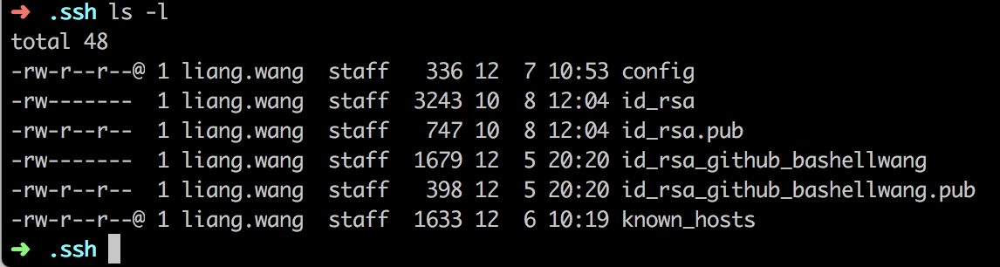

> 公司工作使用 Gitlab，自己需要使用 Github，那么该如何在同一台 Mac 上配置多个账号呢

#### 思路

ssh 方式链接到 Github/Gitlab,需要使用唯一的公钥，因此同一台 Mac 绑定多个账号，需要满足两个条件：

- 生成对应的私钥/公钥
- 设置不同的 Host 和 HostName 配置
- 为每个仓库独立配置 用户名/用户邮箱

<!-- more -->

#### 操作

1.命令行里输入 `ls ~/.ssh`,查看目前已有的密钥，如果有 `id_rsa` 和 `id_rsa.pub`，说明已经有了一对密钥。我的 mac 是已经有了 Gitlab 的密钥

2.生成新的密钥：

`ssh-keygen -t rsa -f ~/.ssh/id_rsa_github_bashellwang -C "youremail@xx.com"`
	
生成密钥后，我的 ssh 目录下如图所示：
	


3.在 `.ssh` 文件夹下新建 `config` 目录（如果没有的话），进行内容编辑如下：

```
# gitlab shopee
                                                             
Host gitlab.com
HostName gitlab.com
User git
IdentityFile ~/.ssh/id_rsa


# gitHub bashellwang
                                                                        
Host github.com
HostName github.com
User git
IdentityFile ~/.ssh/id_rsa_github_bashellwang
```

4. 将生成的新密钥 `id_rsa_github_bashellwang.pub` 中内容复制到 Github 

5. 测试连接

```
ssh -T git@github.com
```
6. 将 Github 项目 clone 到本地，然后进入项目文件夹设置 用户名/邮箱

```
git config user.name "xxx"
git config user.email "xxx@xxx.com"
```

由于工作用到 Gitlab 比较多，因此全局设置的公司账号，GitHub 的仓库则是单独设置的 用户名/邮箱，这样即可两个账号使用了。
