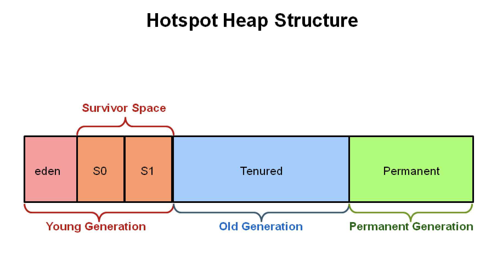
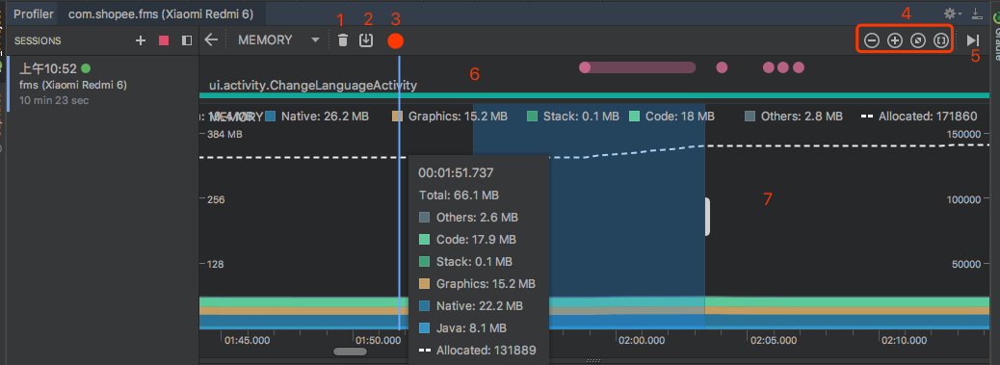
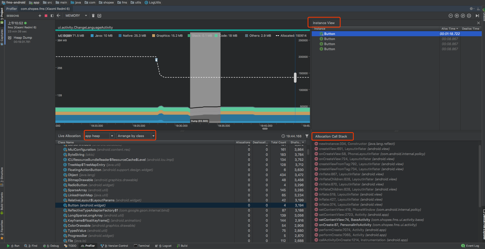
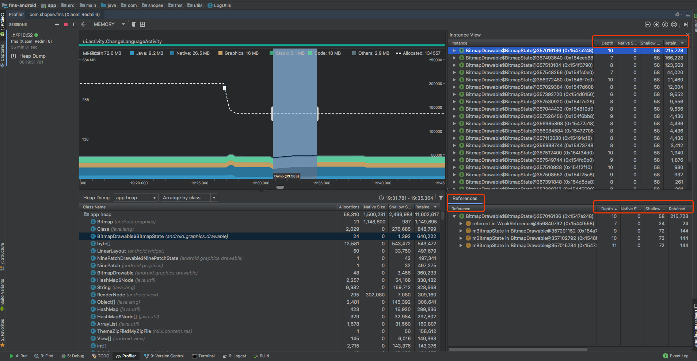
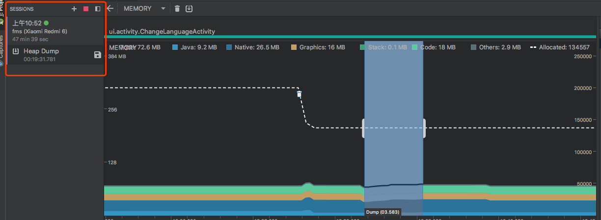
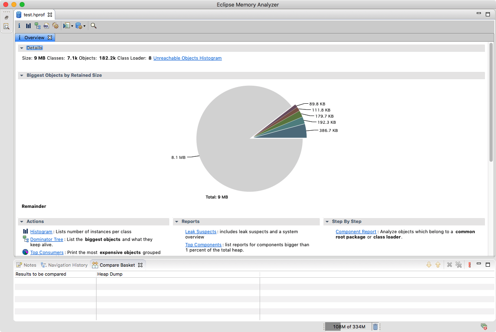
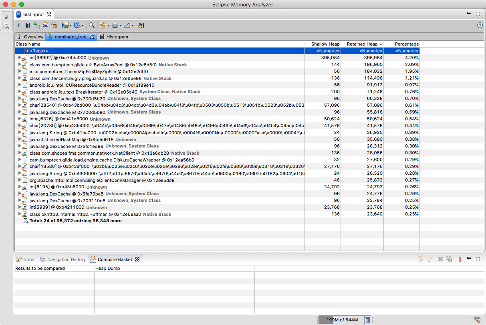
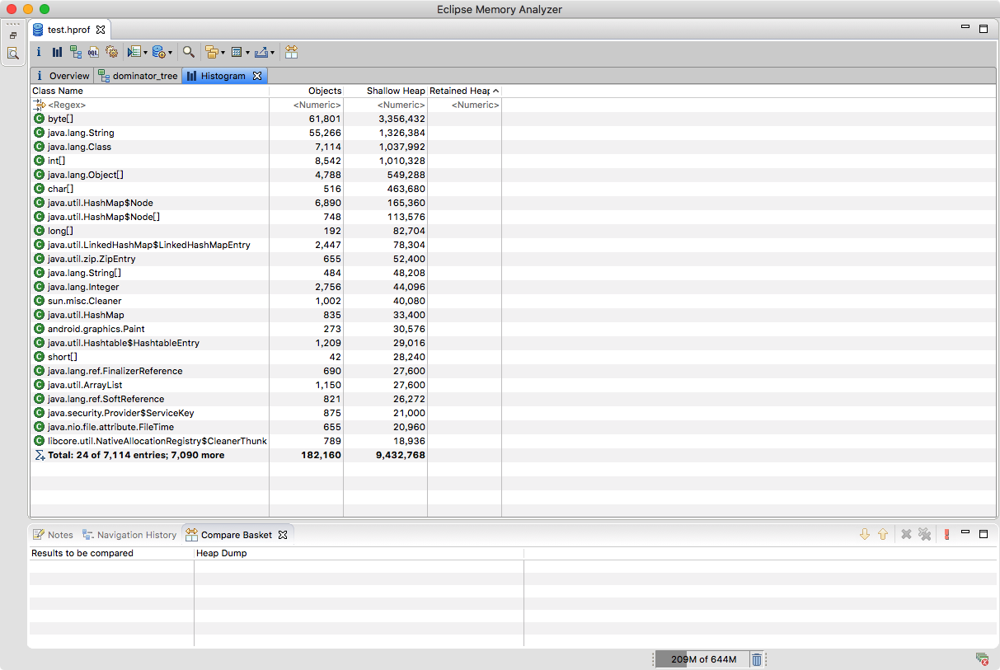

> 前言：App 的内存使用情况是我们评价 App 性能高低的一个重要指标，为了提高 App 的质量，提供用户更良好的体验，需要我们对 App 的内存使用有一定的控制。因此，内存优化也是我们开发过程中不可避免的一个工作。本文将从内存优化的背景知识、内存优化工具、常见内存泄漏类型及解决方案等方面做一个简单介绍。

> 注：目前 Android Studio 已到最新版 3.2.1，部分内存分析工具已被官方废弃或移除，本文将以 Studio 最新版进行内存优化的相关介绍说明。 

### Java 内存基础知识介绍

#### Java 内存分配策略

Java 程序运行时会把它所管理的内存划分为若干个不同的数据区域，这些数据区域各有用途。主要分为下面几个部分：

- 静态存储区（方法区）：主要存放已被虚拟机加载的类信息、常量、静态变量等。这块内存在程序编译时就已经分配好，并且在程序整个运行期间都存在。
- 栈区：方法体内的局部变量（一些基本类型的变量和对象的引用变量）都在栈上创建，并在方法执行结束时这些局部变量所持有的内存将会被自动释放
- 堆区：又称动态内存分配区，主要用来存放 Java 对象实例（包括该对象其中的所有成员变量）和数组。它们不再使用时，由 Java 垃圾回收器来负责回收。在堆中产生了一个数组或者对象后，还可以在栈中定义一个特殊的变量，这个变量的取值等于数组或者对象在堆内存中的首地址，这个特殊的变量就是我们上面说的引用变量。我们可以通过这个引用变量来访问堆中的对象或者数组。

<!-- more -->

#### Java 内存释放策略

Java 内存的分配由程序员来处理，内存的释放则由 GC(垃圾回收机制)来负责。程序员不需要通过调用函数来释放内存，也因此带来了内存泄漏的可能

> 静态分配不需要释放，栈式内存分配仅通过帧栈自动出入栈，这里不讨论

##### Generational Heap Memory 内存模型

在 Android 和 Java 中都存在着一个 Generational Heap Memory 模型，系统会根据内存中不同的内存数据类型分别执行不同的 GC 操作。Generational Heap Memory 模型也叫三级 Generation 内存模型，主要由由以下区域组成：

- Young Generation（新生代）
- Old Generation（老年代）
- Permanent Generation（持久代）



Young Generation 存放最近被创建的对象，当对象在该区域停留到一定时间，它会被移动到 Old Generation 区域，同理，也会被移动到 Permanent Generation 区域。新生代区域创建快，销毁也很快。

在三级内存模型中，每一个区域的大小都是有固定值的，当进入到该区域的内存对象大小超过阈值时就会触发 GC 机制，进行内存回收。不仅如此，不同区域的 GC 时间也是不同的。

同等对象数目下，新生代所需时间最短，老年代次之，持久代需要的时间最长。当然 GC 执行的长短也和当前 Generation 区域中的对象数目有关。数量越多，GC 时间越久。

##### 判定对象是否存活

内存对象释放的原则就是`『对象不再被引用』`，垃圾收集器在对堆进行回收前，需要确定哪些对象还 “存活” 着。

- 引用计数法：给对象添加一个引用计数器，每当有一个地方引用它时，计数器值就加 1；当引用失效时，计数器值就减 1；任何时刻计数器为 0 的对象就是不可能再被使用的。该算法实现简单，判定效率也很高，但是由于它很难解决对象之间相互循环引用的问题，因而在主流的 Java 虚拟机里没有选用它来管理内存。
- 可达性分析算法：通过一系列的称为 “GC Roots” 的对象作为起始点，从这些节点开始向下搜索，搜索所走过的路径称为引用链，当一个对象到 GC Roots 没有任何引用链时，则证明该对象是不可用的。目前主流商用程序语言的主流实现中，都是通过该算法来判定对象是否存活的。

##### 垃圾回收算法

内存释放的核心是垃圾回收算法，我们这里介绍最常见的几种垃圾回收算法。

- 标记-清除算法：首先标记出所有需要回收的对象，在标记完成后统一回收所有被标记的对象。
- 复制算法：将可用内存按容量划分为大小相等的两块，每次只使用其中一块。当这一块内存用完了，就将还存活的对象复制到另外一块上面，然后再把已使用过的内存空间一次清理掉。
- 标记-整理算法：首先标记出所有需要回收的对象，然后让所有存货的对象都向一端移动，之后直接清理掉端边界以外的内存。
- 分代收集算法：根据对象存活周期不同将 Java 堆分为新生代和老年代，然后根据每个区域特点选择对应的垃圾收集算法。

**标记-清除算法**：是最基础的收集算法，后续的收集算法都是基于这种思路并对其不足进行改进而得到的。它的主要不足有两个：一是效率问题，标记和清除两个过程的效率都不高；另一个是空间问题，标记清除后会产生大量不连续的内存碎片，空间碎片太多可能会导致以后在程序运行过程中需要分配较大对象时，无法找到足够的连续内存而不得不提前触发另一次垃圾收集动作。

**复制算法**：实现简单，运行高效，它每次回收内存一半区域解决了标记-清除算法中清除效率低的问题；将已使用内存的存活对象移动到栈顶，按顺序分配内存解决了产生不连续空间碎片的问题。但是代价是内存缩小为原来的一半，代价太高了。当存活对象较高时，此时需要很多复制操作，效率会变低。`该算法一般被用来回收新生代数据。`

**标记-整理算法**：该算法一次清除端外区域解决了标记-清除算法中清除效率低的问题；将已使用内存的存活对象移动到栈顶，按顺序分配内存解决了产生不连续空间碎片的问题。`该算法一般被用来回收老年代数据。`

**分代收集算法**：效率高，空间利用率高。新生代和老年代分别采用复制算法，“标记-清除”或“标记-整理”算法。`虚拟机基本都采用这种算法`

### 内存分析工具

在掌握了基本的内存管理相关的知识后，我们需要对 App 进行分析找到内存占用大头，找到的异常内存占用越多，那么我们的优化效果就越明显。

之前的好多内存分析工具在 Android Studio 最新版 3.2.1 中已经被[移除](https://developer.android.com/studio/profile/monitor)，取而代之的是 [memory-profiler](https://developer.android.com/studio/profile/memory-profiler) 。

#### Memory Profile 工具

[memory-profiler](https://developer.android.com/studio/profile/memory-profiler) 是 Android Profiler 中的一个组件，可以帮助我们识别应用卡顿、冻结甚至崩溃的内存泄漏和流失。

##### 如何开启 Memory Profiler

- 点击 `View > Tool Windows > Android Profiler`（也可以点击工具栏中的 Android Profiler ）。
- 从 Android Profiler 工具栏中选择您想要分析的设备和应用进程。 如果您通过 USB 连接了某个设备但该设备未在设备列表中列出，请确保您已启用 USB 调试。
- 点击 **MEMORY **时间线中的任意位置可打开 Memory Profiler。

##### 面板说明



如图所示，Memory Profiler 默认视图包含以下各项：

1. 用于强制执行垃圾回收 Event 的按钮。
2. 用于捕获堆转储的按钮。
3. 用于记录内存分配情况的按钮。 此按钮仅在连接至运行 Android 7.1 或更低版本的设备时才会显示。
4. 用于放大/缩小时间线的按钮。
5. 用于跳转至实时内存数据的按钮。
6. Event 时间线，其显示 Activity 状态、用户输入 Event 和屏幕旋转 Event。
7. 内存使用量时间线，其包含以下内容：
	- 一个显示每个内存类别使用多少内存的堆叠图表，如左侧的 y 轴以及顶部的彩色键所示。
	- 虚线表示分配的对象数，如右侧的 y 轴所示。
	- 用于表示每个垃圾回收 Event 的图标

##### 指标参数说明


如图所示，内存计数中类别如下：

- **Java**：从 Java 或 Kotlin 代码分配的对象内存。
- **Native**：从 C 或 C++ 代码分配的对象内存。

	即使您的应用中不使用 C++，您也可能会看到此处使用的一些原生内存，因为 Android 框架使用原生内存代表您处	理各种任务，如处理图像资源和其他图形时，即使您编写的代码采用 Java 或 Kotlin 语言。
- **Graphics**：图形缓冲区队列向屏幕显示像素（包括 GL 表面、GL 纹理等等）所使用的内存。 （请注意，这是与 CPU 共享的内存，不是 GPU 专用内存。）
- **Stack**： 您的应用中的原生堆栈和 Java 堆栈使用的内存。 这通常与您的应用运行多少线程有关。
- **Code**：您的应用用于处理代码和资源（如 dex 字节码、已优化或已编译的 dex 码、.so 库和字体）的内存。
- **Other**：您的应用使用的系统不确定如何分类的内存。
- **Allocated**：您的应用分配的 Java/Kotlin 对象数。 它没有计入 C 或 C++ 中分配的对象。

当连接至运行 Android 7.1 及更低版本的设备时，此分配仅在 Memory Profiler 连接至您运行的应用时才开始计数。 因此，您开始分析之前分配的任何对象都不会被计入。 不过，Android 8.0 附带一个设备内置分析工具，该工具可记录所有分配，因此，在 Android 8.0 及更高版本上，此数字始终表示您的应用中待处理的 Java 对象总数。

##### 查看内存区域



在点击并按住时间线，并拖动选择您想要查看分配的区域之后，已分配对象的列表将显示在时间线下方，默认按类名称分类，并按堆计数排好序。

1. 浏览列表以查找堆计数异常大且可能存在泄漏的对象。 为帮助查找已知类，点击 Class Name 列标题以按字母顺序排序。 然后点击一个类名称。 此时在右侧将出现 Instance View 窗格，显示该类的每个实例，如图中所示。
2. 在 Instance View 窗格中，点击一个实例。 此时下方将出现 Call Stack 标签，显示该实例被分配到何处以及哪个线程中。
3. 在 Call Stack 标签中，点击任意行以在编辑器中跳转到该代码。

默认情况下，左侧的分配列表按类名称排列。 在列表顶部，您可以使用右侧的下拉列表在以下排列方式之间进行切换：

- **Arrange by class**：基于类名称对所有分配进行分组。
- **Arrange by package**：基于软件包名称对所有分配进行分组。
- **Arrange by callstack**：将所有分配分组到其对应的调用堆栈。

##### 捕获堆转储



在点击 Dump Java Heap 按钮后，Studio 会自动记录一段时间内的 Java Heap，如图所示，这里我们可以看到很多信息。

在类列表，可以查看下吗信息：

- **Heap Count**：堆中的实例数。
- **Shallow Size**：此堆中所有实例的总大小（以字节为单位）。
- **Retained Size**：为此类的所有实例而保留的内存总大小（以字节为单位）。

在类列表顶部，可以使用左侧下拉列表在以下堆转储之间进行切换：

- **Default heap**：系统未指定堆时。
- **App heap**：您的应用在其中分配内存的主堆。
- **Image heap**：系统启动映像，包含启动期间预加载的类。 此处的分配保证绝不会移动或消失。
- **Zygote heap**：写时复制堆，其中的应用进程是从 Android 系统中派生的。

在 Instance View 中，每个实例都包含以下信息：

- **Depth**：从任意 GC 根到所选实例的最短 hop 数。
- **Shallow Size**：此实例的大小。
- **Retained Size**：此实例支配的内存大小（根据 [dominator 树](https://en.wikipedia.org/wiki/Dominator_(graph_theory))）。

##### 堆转储另存为 HPROF

我们之前查看堆转储时都是在设备连接在 Studio 上进行的，如果我们设备不在了，或者需要将堆转储发给其它人，就需要将堆转储另存为 HPROF 文件了。



如图所示，在 Sessions 面板下，可以点击保存图标或者右键我们要保存的 Heap Dump 即可保存为 HPROF 文件了。然后在 Studio 中即可双击打开分析了。

如果需要使用到其它的 HPROF 分析器，则需要将 HPROF 文件从 Android 格式转换为 Java SE HPROF 格式。 我们可以使用 `android_sdk/platform-tools/` 目录中提供的 `hprof-conv` 工具执行此操作。 运行包括以下两个参数的 hprof-conv 命令：`原始 HPROF 文件和转换后 HPROF 文件的写入位置`。 例如：

```
hprof-conv heap-original.hprof heap-converted.hprof
```

Memory Profiler 的功能十分强大，需要在实际使用中不断熟悉，总结经验

#### MAT 

虽然 Memory Profile 功能很强大，能够满足大部分需求，但是在需要更详细的分析时，还是需要借用 Eclipse 的 [MAT](https://www.eclipse.org/mat/) 来分析。

MAT 有独立的不依赖 Eclipse 的版本可供使用，[下载地址](https://www.eclipse.org/mat/downloads.php)，[官方文档](https://wiki.eclipse.org/MemoryAnalyzer), [Introduction](https://help.eclipse.org/luna/index.jsp?topic=%2Forg.eclipse.mat.ui.help%2Ftasks%2Fanalyzingjavacollectionusage.html)。

这里有一篇讲解很详细的博文可参考：[利用 MAT 进行内存泄漏分析](https://blog.csdn.net/yxz329130952/article/details/50288145)

##### Overview

在获取了 HPROF 文件后，通过 MAT 打开就可以直观的看到当前的内存信息。一般来说，包含以下这些信息：

- 所有的对象信息，包括对象实例、成员变量、存储于栈中的基本类型值和存储于堆中的其他对象的引用值。
- 所有的类信息，包括classloader、类名称、父类、静态变量等
- GCRoot 到所有的这些对象的引用路径
- 线程信息，包括线程的调用栈及此线程的线程局部变量（TLS）

通过 Android Studio 保存的 HPROF 文件无法直接通过 MAT 打开，需要使用 `hprof-conv` 转换，转换后打开的界面如下图所示：



##### Dorminator Tree

支配树可以直观反映一个对象的 retained heap，会将所有内存中的对象按大小进行排序，并且我们可以分析对象之间的引用结构。

- shallow heap:指的是某一个对象所占内存大小。
- retained heap:指的是一个对象的 retained set所包含对象所占内存的总大小。



##### Histogram

以直方图的方式来显示当前内存使用情况可能更加适合较为复杂的内存泄漏分析，它默认直接显示当前内存中各种类型对象的数量及这些对象的 shallow heap 和 retained heap 。结合 MAT 提供的不同显示方式，往往能够直接定位问题，当我们切换到 histogram 视图下时，如图所示



通常我们可以在怀疑的对象上，右键选择 list objects -> with incoming reference ，从而可以获取到达 GC Roots 的最短引用路径，以此来判定是哪里在引用导致的内存没被回收。

##### 两个 HPROF 文件对比

通过对比两个 HPROF 文件，可以知道两个版本之间，内存的增量在哪些地方

#### LeakCanary 工具

[LeakCanary](https://github.com/square/leakcanary) 是开源大户 Square 提供的给 Android 和 Java 做内存泄漏检测的库。它的优势是集成简单，易于发现问题，检测结果可视化

更多详情可参考 [FAQ](https://github.com/square/leakcanary/wiki/FAQ)

### 内存优化排查套路

内存优化最核心的就是需要尽可能多的找到异常内存占用，找到的异常占用越多，异常占用越大，我们优化后的效果就会越好。

这里简单介绍下我的内存优化排查套路，由简单到复杂：

1. Android lint 扫描，对扫描出来的内存泄漏、循环体内字符串拼接等进行修复
2. bugly 等异常上报系统上报的 OOM 修复
3. leakcanary 检查出的内存泄漏
4. 图片相关
5. 静态内存分析优化
6. 动态内存分析优化

通过前三步可以将一些很明显的内存泄漏的问题给修复掉；然后是修复图片相关的，下一节会给出解决方案。

静态内存分析是整个 App 运行期都存在的那部分内存，分析方法是：打开 App 大量重度使用，然后回到首页，进开发者选项打开 “不保留后台活动”，之后 App 退到后台。最后 gc 并 dump 出内存快照进行分析。

动态内存分析就是分析每个页面运行时的内存状态，这一部分是随着 App 运行而不断变化的内存，主要有两种方式：

- 导出每个页面的内存快照，并和上一个页面进行对比，针对性的优化处理
- 通过 USB 连接设备，在 Memory Profiler 里实时观察每个页面的内存变化情况，对异常内存变化进行分析

### 常见内存问题及解决

根据经验，内存优化中的大头主要是两个：**内存泄漏和图片**，除了这两个之外还有一些其他常见的内存优化点

- 内存泄漏
- 图片 Bitmap 相关
- 内存抖动
- 其它

下面分别介绍下各个常见内存问题场景及解决方案

#### 内存泄漏

内存泄漏应该是最常见的内存问题了，这里简单介绍下 [Android 性能优化之常见的内存泄漏](https://blog.csdn.net/u010687392/article/details/49909477)

- 单例
- 静态变量
- Handler 内存泄漏
- 非静态内部类创建静态实例：通过静态变量持有内部类对象的引用，也会发生内存泄漏
- 匿名内部类
- 资源使用完未关闭：SensorManager以及广播接收器，对于使用了 BraodcastReceiver，ContentObserver，File， Cursor，Stream，Bitmap 等资源的使用，应该在 Activity 销毁时及时关闭或者注销，否则这些资源将不会被回收，造成内存泄漏
- 不良代码

##### 单例导致的内存泄漏

单例的静态特性使得单例的生命周期和 App 生命周期一样长，因此如果一个对象不再被使用，但是单例对象持有了该对象的引用，则会导致该对象无法被释放，从而导致内存泄漏。举例：

```
public class AppManager {
    private static AppManager instance;
    private Context context;
    private AppManager(Context context) {
        this.context = context;
    }
    public static AppManager getInstance(Context context) {
        if (instance != null) {
            instance = new AppManager(context);
        }
        return instance;
    }
}
```
这是一个普通的单例模式，当 Context 传入的是 Activity 的 Context 时，就会导致内存泄漏。因此可这样修改：

```
private AppManager(Context context) {
        this.context = context.getApplicationContext();
    }
```

##### 非静态内部类创建静态实例（静态变量）导致的内存泄漏

如下例所示，内部类默认持有外部类即 Activity 的引用，而内部类有一个静态实例，导致静态实例引用了外部 Activity。当 Activity 不再使用时，由于它被静态变量所引用，无法被回收，导致内存泄漏。

修改方案是将该内部类设为静态内部类或将该内部类抽取出来封装成一个单例，如果需要使用 Context，请使用 ApplicationContext

```
public class MainActivity extends AppCompatActivity {
    private static TestResource mResource = null;
    @Override
    protected void onCreate(Bundle savedInstanceState) {
        super.onCreate(savedInstanceState);
        setContentView(R.layout.activity_main);
        if(mManager == null){
            mManager = new TestResource();
        }
        //...
    }
    class TestResource {
        //...
    }
}
```

##### Handler 内存泄漏

Handler 使用造成的内存泄漏问题也比较常见，如下例所示：

```
public class MainActivity extends AppCompatActivity {
    private Handler mHandler = new Handler() {
        @Override
        public void handleMessage(Message msg) {
            //...
        }
    };
    @Override
    protected void onCreate(Bundle savedInstanceState) {
        super.onCreate(savedInstanceState);
        setContentView(R.layout.activity_main);
        loadData();
    }
    private void loadData(){
        //...request
        Message message = Message.obtain();
        mHandler.sendMessage(message);
    }
}
```
这种创建 Handler 的方式会造成内存泄漏，由于 mHandler 是 Handler 的非静态匿名内部类的实例，所以它持有外部类 Activity 的引用，我们知道消息队列是在一个 Looper 线程中不断轮询处理消息，那么当这个 Activity 退出时消息队列中还有未处理的消息或者正在处理消息，而消息队列中的 Message 持有 mHandler 实例的引用， mHandler 又持有 Activity 的引用，所以导致该 Activity 的内存资源无法及时回收，引发内存泄漏，所以另外一种做法为：

```
public class MainActivity extends AppCompatActivity {
    private MyHandler mHandler = new MyHandler(this);
    private TextView mTextView ;
    private static class MyHandler extends Handler {
        private WeakReference<Context> reference;
        public MyHandler(Context context) {
            reference = new WeakReference<>(context);
        }
        @Override
        public void handleMessage(Message msg) {
            MainActivity activity = (MainActivity) reference.get();
            if(activity != null){
                activity.mTextView.setText("");
            }
        }
    }

    @Override
    protected void onCreate(Bundle savedInstanceState) {
        super.onCreate(savedInstanceState);
        setContentView(R.layout.activity_main);
        mTextView = (TextView)findViewById(R.id.textview);
        loadData();
    }

    private void loadData() {
        //...request
        Message message = Message.obtain();
        mHandler.sendMessage(message);
    }

    @Override
    protected void onDestroy() {
        super.onDestroy();
        mHandler.removeCallbacksAndMessages(null);
    }
}
```
创建一个静态 Handler 内部类，然后对 Handler 持有的对象使用弱引用，这样在回收时也可以回收 Handler 持有的对象，这样避免了 Activity 泄漏。

不过 Looper 线程的消息队列中还是可能会有待处理的消息，所以我们在 Activity 的 Destroy 时或者 Stop 时应该移除消息队列中的消息，使用 `mHandler.removeCallbacksAndMessages(null)` 是移除消息队列中所有消息和所有的 Runnable。

也可以使用 `mHandler.removeCallbacks()` 或 `mHandler.removeMessages()` 来移除指定的 Runnable 和 Message 。

##### 线程造成的内存泄漏

```
//——————test1
        new AsyncTask<Void, Void, Void>() {
            @Override
            protected Void doInBackground(Void... params) {
                SystemClock.sleep(10000);
                return null;
            }
        }.execute();
//——————test2
        new Thread(new Runnable() {
            @Override
            public void run() {
                SystemClock.sleep(10000);
            }
        }).start();
```
上面的异步任务和 Runnable 都是一个匿名内部类，因此它们对当前 Activity 都有一个隐式引用。如果 Activity 在销毁之前，任务还未完成， 
那么将导致 Activity 的内存资源无法回收，造成内存泄漏。

正确的做法还是使用静态内部类的方式

```
static class MyAsyncTask extends AsyncTask<Void, Void, Void> {
        private WeakReference<Context> weakReference;

        public MyAsyncTask(Context context) {
            weakReference = new WeakReference<>(context);
        }

        @Override
        protected Void doInBackground(Void... params) {
            SystemClock.sleep(10000);
            return null;
        }

        @Override
        protected void onPostExecute(Void aVoid) {
            super.onPostExecute(aVoid);
            MainActivity activity = (MainActivity) weakReference.get();
            if (activity != null) {
                //...
            }
        }
    }
    static class MyRunnable implements Runnable{
        @Override
        public void run() {
            SystemClock.sleep(10000);
        }
    }
//——————
    new Thread(new MyRunnable()).start();
    new MyAsyncTask(this).execute();
```
这样就避免了 Activity 的内存资源泄漏，当然在 Activity 销毁时候也应该取消相应的任务 AsyncTask::cancel()，避免任务在后台执行浪费资源

##### 集合中对象未清理造成的内存泄漏

这个比较好理解，如果一个对象放入到 ArrayList、HashMap 等集合中，这个集合就会持有该对象的引用。当我们不再需要这个对象时，也并没有将它从集合中移除，这样只要集合还在使用（而此对象已经无用了），这个对象就造成了内存泄露。并且如果集合被静态引用的话，集合里面那些没有用的对象更会造成内存泄露了。所以在使用集合时要及时将不用的对象从集合 remove，或者 clear 集合，以避免内存泄漏。


##### 资源使用完未关闭导致内存泄漏

对于使用了 BraodcastReceiver，ContentObserver，File，Cursor，Stream，Bitmap 等资源的使用，这些资源在进行读写操作时通常都使用了缓冲，如果不及时关闭，这些缓冲对象就会一直被占用而得不到释放，以致发生内存泄露。因此在不使用时需要及时关闭或释放它们。

##### 属性动画导致内存泄漏

动画同样是一个耗时任务，比如在 Activity 中启动了属性动画（ObjectAnimator），但是在销毁的时候，没有调用 cancle 方法，虽然我们看不到动画了，但是这个动画依然会不断地播放下去，动画引用所在的控件，所在的控件引用 Activity，这就造成 Activity 无法正常释放。因此同样要在 Activity 销毁的时候 cancel 掉属性动画，避免发生内存泄漏。

##### WebView 导致内存泄漏

关于 WebView 的内存泄露，因为 WebView 在加载网页后会长期占用内存而不能被释放，因此我们在 Activity 销毁后要调用它的 destory() 方法来销毁它以释放内存。

Webview 下面的 Callback 持有 Activity 引用，造成 Webview 内存无法释放，即使是调用了 Webview.destory() 等方法都无法解决问题（Android5.1 之后）。

因此，在销毁 webview 之前需要先将其从父容器中移除，然后再销毁 webview。详细分析过程参考 [WebView 内存泄漏解决方法](https://blog.csdn.net/xygy8860/article/details/53334476)

```
@Override
protected void onDestroy() {
    super.onDestroy();
    // 先从父控件中移除WebView
    mWebViewContainer.removeView(mWebView);
    mWebView.stopLoading();
    mWebView.getSettings().setJavaScriptEnabled(false);
    mWebView.clearHistory();
    mWebView.removeAllViews();
    mWebView.destroy();
}
```

#### 图片 Bitmap 相关

##### 分辨率适配问题

通常我们可以通过将图片放在 hdpi/xhdpi/xxhdpi 等不同文件夹中进行适配，系统在解析时会对 Bitmap 根据当前设备屏幕像素密度 densityDpi 的值进行缩放适配操作，使得解析出来的 Bitmap 与当前设备的分辨率匹配，达到一个最佳的显示效果，并且 Bitmap 的大小将比原始的大。具体分析可参考：[你的 Bitmap 究竟占多大内存？](https://mp.weixin.qq.com/s?__biz=MzA3NTYzODYzMg==&mid=403263974&idx=1&sn=b0315addbc47f3c38e65d9c633a12cd6&scene=21#wechat_redirect)

因此在存放图片资源目录时需要注意选择合适的目录位置。

##### 选择合适的颜色模式

**`ARGB_8888`** 和 **`RGB_565`** 颜色模式在大部分场景下没有明显区别，但是 由于 ARGB_8888 多了一个透明度通道，导致的内存占用会翻倍，因此在实际程序使用时需要好好考虑如何选择合适的颜色模式。

##### 适当降低图片大小

不要使用多大的图片，可以使用类似 [tinypng](https://tinypng.com/) 的工具进行无损压缩

##### 图片压缩

Bitmap 在解码图片时，可以使用一个 Option 来进行一些自定义的设置

- inTargetDensity 表示要被画出来时的目标像素密度

- inSampleSize 这个值是一个 int，当它小于 1 的时候，将会被当做 1 处理，如果大于 1，那么就会按照比例（1 / inSampleSize）缩小 bitmap 的宽和高、降低分辨率，大于 1 时这个值将会被处置为 2 的倍数。例如，width=100，height=100，inSampleSize=2，那么就会将 bitmap 处理为，width=50，height=50，宽高降为 1 / 2，像素数降为 1 / 4

- inJustDecodeBounds 字面意思就可以理解就是只解析图片的边界，有时如果只是为了获取图片的大小就可以用这个，而不必直接加载整张图片。

- inPreferredConfig 默认会使用 ARGB_8888,在这个模式下一个像素点将会占用 4 个 byte,而对一些没有透明度要求或者图片质量要求不高的图片，可以使用 RGB_565，一个像素只会占用 2 个 byte，一下可以省下 50% 内存。

- inPurgeable 和 inInputShareable 这两个需要一起使用，BitmapFactory.java 的源码里面有注释，大致意思是表示在系统内存不足时是否可以回收这个 bitmap，有点类似软引用，但是实际在 5.0 以后这两个属性已经被忽略，因为系统认为回收后再解码实际会反而可能导致性能问题

- inBitmap 官方推荐使用的参数，表示重复利用图片内存，减少内存分配，在 4.4 以前只有相同大小的图片内存区域可以复用，4.4 以后只要原有的图片比将要解码的图片大既可以复用了。

##### 使用完毕后释放图片资源

在 Android 2.3.3（API 10）前，使用 Bitmap.recycle() 方法，而使用该 API 的设备基本被淘汰了。

现在尽量使用软引用 (SoftReference) 的方式来使用图片资源

##### 设置图片缓存

对于一些重复图片可以使用全局 bitmap 缓存池，App 全局使用同一张 bitmap，复用同一份。

#### 内存抖动

Android 里内存抖动是指内存频繁地分配和回收，而频繁的 gc 会导致卡顿，严重时还会导致 OOM。因为大量小对象的创建会造成内存碎片，虽然整体上内存大小还足够，但是不能分配出连续的可用内存，导致系统 OOM。

一个典型案例就是 string 拼接创建大量小的对象（比如在一些频繁打印字符串拼接的日志里），见
[Android 性能优化之 String 篇](https://blog.csdn.net/vfush/article/details/53038437)

#### 其它

- 构造 Adapter 时，没有使用缓存的 convertView
- 对象的注册和反注册没有成对出现
- 不在执行频率很高的地方，或者循环体内创建对象
- 避免循环引用

### 小结

本文简单介绍了 Java 内存基础知识背景，常见内存分析工具 Memory Profiler 和 MAT 的使用，内存优化的排查套路以及常见内存问题的修复。

Android 内存优化是一个实践性非常强的工作，需要在实际工作中不断应用总结。

### 参考资料

- [使用 Memory Profiler 查看 Java 堆和内存分配](https://developer.android.com/studio/profile/memory-profiler)
- [（Android Studio 3.0）Android Profiler 内存泄漏检查](https://blog.csdn.net/Double2hao/article/details/78784758)
- [利用 MAT 进行内存泄漏分析](https://blog.csdn.net/yxz329130952/article/details/50288145)
- [Android内存优化（五）详解内存分析工具MAT](https://blog.csdn.net/itachi85/article/details/77075455)
- [Java Garbage Collection Basics](https://www.oracle.com/webfolder/technetwork/tutorials/obe/java/gc01/index.html)
- [Android 开发绕不过的坑：你的 Bitmap 究竟占多大内存？](https://mp.weixin.qq.com/s?__biz=MzA3NTYzODYzMg==&mid=403263974&idx=1&sn=b0315addbc47f3c38e65d9c633a12cd6&scene=21#wechat_redirect)
- [Android 内存优化——常见内存泄露及优化方案](https://www.jianshu.com/p/ab4a7e353076)
- [Android 性能优化之常见的内存泄漏](https://blog.csdn.net/u010687392/article/details/49909477)
- [Android 内存优化总结 & 实践](https://mp.weixin.qq.com/s/2MsEAR9pQfMr1Sfs7cPdWQ)
- [[贝聊科技]使用 Android Studio 和 MAT 进行内存泄漏分析](https://juejin.im/post/595371d0f265da6c375a7879)
- [Android 性能优化：那些关于 Bitmap 图片资源优化的小事](https://blog.csdn.net/carson_ho/article/details/79549382)
 


