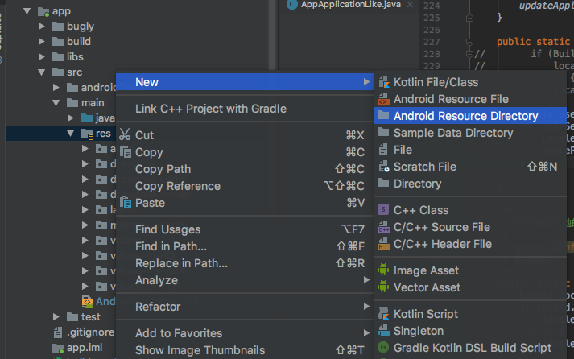
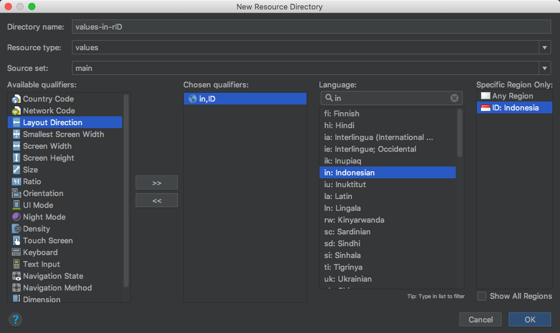

> 前言：公司 App 主要面向东南亚市场，因此必须针对东南亚市场做多语言国际化的实现。

### 需求

- 支持 App 内切换语言系统，不跟随系统语言变化
- 重启后，使用用户上次选择记录的语言

### 实现

#### 生成资源文件

首先需要生成对应语言的资源文件，这一点 Studio 还是挺方便的。

<!-- more -->



在 res 目录下新建一个 Android 资源目录，选择 locale 然后在列表里选择对应的国家语言后，命名后保存，系统就会帮我们生成符合要求格式的文件。



这里如果有一些国家码不清楚或不知如何选择的话，也可以看看这个表查找下

[每个国家对应的语言Locale和国家代码对照表](http://www.cnblogs.com/jacksoft/p/5771130.html)

#### 创建多语言工具类

```
/**
 * 1. AppApplication 中 attachBaseContext 会根据配置版本存储并设置语言
 * 2. BaseActivity 中 attachBaseContext 里设置语言并更新 context ，便于使用过程中语言切换
 */
public class LanguageUtils {
    public static final String TAG = "LanguageUtils";
    public static final Locale ENGLISH = Locale.ENGLISH;
    public static final String ENGLISH_LANGUAGE_TAG = ENGLISH.toLanguageTag();
    public static final Locale INDONESIA = new Locale("in");
    public static final String INDONESIA_LANGUAGE_TAG = INDONESIA.toLanguageTag();//"id"
    public static final Locale MALAYSIA = new Locale("ms");
    public static final String MALAYSIA_LANGUAGE_TAG = MALAYSIA.toLanguageTag();//"ms"
    public static final String KEY = "store_language";

    /**
     * gradle 中配置值区分不同版本，发布时需要修改配置值
     */
    public static final int COUNTRY_VERSION_ID = 1;// 印尼版本
    public static final int COUNTRY_VERSION_MY = 2;// 马来版本

    /**
     * 设置 app 语言，兼容 8.0 及以上系统
     *
     * @param context
     * @return
     */
    public static Context setAppLocalLanguage(Context context) {
        Locale locale = getUserSetLanguageLocal(context);
        return updateConfiguration(context, locale);
    }

    /**
     * @param context
     * @param locale
     * @return
     */
    private static Context updateConfiguration(Context context, Locale locale) {
        if (context == null) {
            return null;
        }
        Locale.setDefault(locale);
        Resources res = context.getResources();
        Configuration config = res.getConfiguration();
        if (Build.VERSION.SDK_INT >= Build.VERSION_CODES.N) {
            config.setLocale(locale);
            context = context.createConfigurationContext(config);
        } else {
            config.locale = locale;
            res.updateConfiguration(config, res.getDisplayMetrics());
        }
        return context;
    }

    /**
     * 更新 application 的 updateConfiguration,否则 context.getResource.getString
     * 中 当 context 为applicationContext 时不会生效
     *
     * @param context
     */
    public static void updateApplicationConfiguration(Context context, Locale locale) {
        if (context == null) {
            return;
        }
        Resources resources = context.getApplicationContext().getResources();
        DisplayMetrics dm = resources.getDisplayMetrics();
        Configuration config = resources.getConfiguration();
        config.locale = locale;
        if (Build.VERSION.SDK_INT >= Build.VERSION_CODES.N) {
            LocaleList localeList = new LocaleList(locale);
            LocaleList.setDefault(localeList);
            config.setLocales(localeList);
            context.getApplicationContext().createConfigurationContext(config);
            Locale.setDefault(locale);
        }
        resources.updateConfiguration(config, dm);
    }

    /**
     * 获取用户设置的语言 locale
     *
     * @return
     */
    public static Locale getUserSetLanguageLocal(Context context) {
        return Locale.forLanguageTag(getUserSetLanguageTag(context));
    }

    /**
     * 获取用户设置的语言 tag
     *
     * @return
     */
    public static String getUserSetLanguageTag(Context context) {
        if (context == null) {
            LogUtils.e(KEY, "context is empty!");
            return "";
        }
        return SharePreferenceUtils.getString(context, KEY, getLanguageLocaleFromGradle().toLanguageTag());
    }

    /**
     * 从 gradle 中根据国家配置获取 locale 值
     *
     * @return
     */
    public static Locale getLanguageLocaleFromGradle() {
        Locale locale = Locale.ENGLISH;
        switch (com.shopee.fms.BuildConfig.countryVersion) {
            case COUNTRY_VERSION_ID:
                locale = INDONESIA;
                break;
            case COUNTRY_VERSION_MY:
                locale = MALAYSIA;
                break;
            default:
                break;
        }
        return locale;
    }

    /**
     * 保存用户设置的语言 tag
     *
     * @param locale
     */
    public static void saveLanguage(Context context, Locale locale) {
        if (locale == null) {
            LogUtils.e(KEY, "locale is empty!");
            return;
        }
        SharePreferenceUtils.putString(context, KEY, locale.toLanguageTag());
        updateApplicationConfiguration(context, locale);
    }

    public static void saveSystemCurrentLanguage(Context context) {
        Locale userSetLocale = getUserSetLanguageLocal(context);
        if (userSetLocale == null) {
            Locale defaultLocale = getLanguageLocaleFromGradle();
            SharePreferenceUtils.putString(context, KEY, defaultLocale.toLanguageTag());
        }
    }

    /**
     * 当用户手机切换语言时，不跟随
     *
     * @param context
     */
    public static void onConfigurationChanged(Context context) {
        Locale locale = getUserSetLanguageLocal(context);
        updateConfiguration(context, locale);
        updateApplicationConfiguration(context, locale);
    }
}
```

#### 在相应地方调用

1. Application 里使用

```
	@Override
	public void onBaseContextAttached(Context base) {
	    LanguageUtils.saveSystemCurrentLanguage(base);// 保存默认语言
	    super.onBaseContextAttached(LanguageUtils.setAppLocalLanguage(base));
	}
	...
	@Override
	public void onConfigurationChanged(Configuration newConfig) {
		super.onConfigurationChanged(newConfig);
		// 用户切换系统语言时，不影响 app 语言设置
		LanguageUtils.onConfigurationChanged(getApplication());
	}
```

2. BaseActivity 里设置方便统一管理

```
    @Override
    protected void attachBaseContext(Context newBase) {
        Context context = LanguageUtils.setAppLocalLanguage(newBase);
        super.attachBaseContext(context);
    }

```

### 小结

多语言实现方案中，当切换语言后，需要记得更新 Application 的 updateConfiguration，否则使用代码

```
context.getResource.getString()

```
来获取文本时，当 context 为 Application 时会失效。

### 参考文章

- [Android国际化(多语言)实现，支持8.0](https://juejin.im/post/5ac8d62c518825557e78a514)