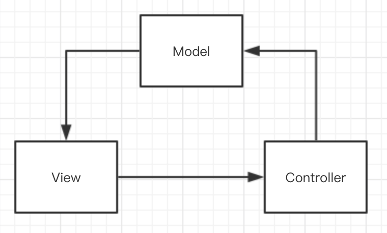
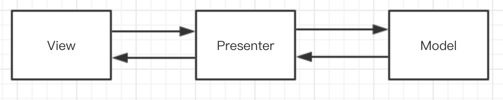
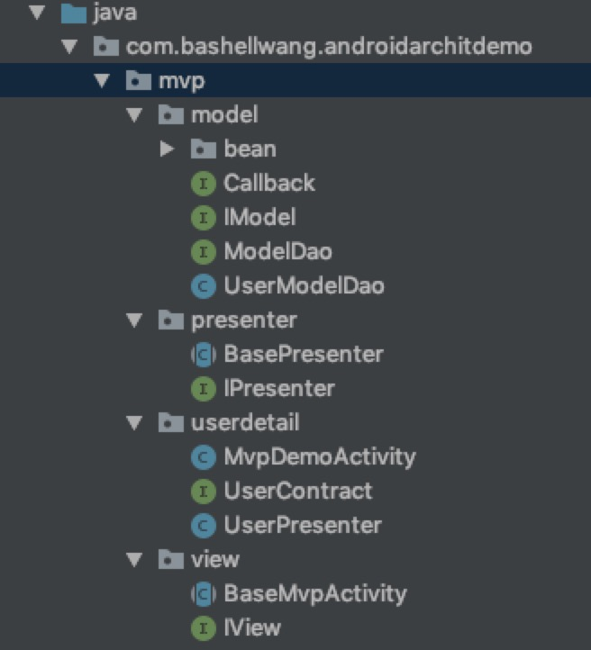
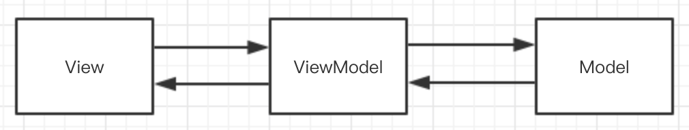

> 总结梳理下 Android 架构设计的几种模式

为什么我们的项目需要使用架构模式？个人理解使用架构模式是为了使我们的代码模块化，达到模块内部高内聚和模块间低耦合的目的，同时开发人员只需要关注相应的业务逻辑点，提高开发效率。当然，使用架构模式不一定是减少了代码量，相反还可能增加代码量；但是它帮你简化了逻辑，提高了扩展性和兼容性。针对不同的项目规模，合理采用或不采用架构模式都是值得考虑的。

### MVC

MVC(Model-View-Controller)



- Model: 模型层。主要是实体类，数据库，网络等存在的层面，Model 将新的数据发送到 View 层，用户得到数据响应。
- View: 视图层。一般以 xml 为代表的视图界面，它显示来自 Model 层的数据，同时将用户的点击操作等事件传送到 Controller 层。
- Controller 控制层。一般以 Activity/Fragment 为代表，它连接 Model 层和 View 层；它收到 View 层发送过来的事件请求，然后从 Model 层获取数据，并展示给 View 层。

<!--more-->

#### 优点

多视图可共用同一模型，重用性高；模块彼此独立清晰，耦合低。

#### 缺点

增加了实现复杂性；视图与控制层联系过于紧密，没有完全解耦；视图层无法组件化，复用比较困难。

### MVP

Model(Model View Presenter),Model: 逻辑模型，View: 视图模型，Presenter: 接口。



MVP 是 MVC 的升级版，让 Model 层和 View 层完全解耦，代码清晰。

MVP 中的 P，是 Presenter 的含义，和 MVC 比较类似，都是将用户对 View 的操作交付给 Presenter，Presenter 会执行相应的逻辑，在这过程中会操作 Model，当 Model 执行完业务逻辑之后，同样是通过观察者模式把自己的结果传递出去，不过不是告诉 View，而是告诉 Presenter，Presenter 得到消息后，通过 View 的接口更新页面。

这里详细代码可查看源码：[AndroidArchitDemo](https://github.com/bashellwang/AndroidArchitDemo)

#### MVP 代码演示



如图所示，代码结构分为三个模块，每个模块内封装了对应的基类。实际使用时，每个页面都会有一个对应的合约(Contract) 类，里面包含该页面的 View 接口和 Presenter 接口。

比如 userdetail 功能页面，里面就有对应的 合约接口类，页面 UI 类以及 Presenter 实现类。这样做结构会比较清晰，当然每新建一个页面都有对应的合约及 Presenter 类，也是比较麻烦。

#### 优点

Model 层和 View 层完成接耦；View 层可以组件化，便于单元测试。

#### 缺点

接口类增多，实现复杂；View 层和 Presenter 层通过接口交互，一旦 View 层某个 UI 元素修改，需要修改接口，则所有接口事件均需要修改

### MVVM



- Model: 模型层，负责数据实现和逻辑处理，类似 MVP。
- View: 视图层，类似 MVP
- ViewModel：创建关联，将 Model 层和 View 层绑定起来，实现双向绑定。

也就是说，MVVM 把 View 和 Model 的同步逻辑自动化了。以前 Presenter 负责的 View 和 Model 同步不再手动地进行操作，而是交由框架所提供的 Binder 进行负责。只需要告诉 Binder，View 显示的数据对应的是 Model 哪一部分即可。

Android 官方推出的 MVVM 的 DataBinding，便是一个双向绑定的库。

#### MVVM 代码演示

启用：build.gradle 中 开启

```
android {
    ...
    
    dataBinding {
        enabled true
    }
}
```

Model 层定义相关的 bean 类以及数据获取逻辑，这块没什么特别之处，这里不特殊说明。

View 层即界面布局 xml 和 Activity 中引用

```
<?xml version="1.0" encoding="utf-8"?>
<layout xmlns:android="http://schemas.android.com/apk/res/android"
    xmlns:app="http://schemas.android.com/apk/res-auto">
    <data>
        <variable
            name="viewModel" type="com.bashellwang.androidarchitdemo.mvvm.viewmodel.SchoolViewModel" />
    </data>

    <android.support.constraint.ConstraintLayout
        android:layout_width="match_parent"
        android:layout_height="match_parent">

        <TextView
            android:layout_marginTop="50dp"
            android:id="@+id/tv_name"
            android:layout_width="wrap_content"
            android:layout_height="wrap_content"
            android:text="@{viewModel.mSchool.toString()}"
            android:textColor="#000000"
            android:textSize="16sp"
            app:layout_constraintLeft_toLeftOf="parent"
            app:layout_constraintRight_toRightOf="parent"
            app:layout_constraintTop_toTopOf="parent" />

        <TextView
            android:id="@+id/tv_desc"
            android:layout_width="wrap_content"
            android:layout_height="wrap_content"
            android:text="@{viewModel.mSchool.description}"
            android:textColor="#000000"
            android:layout_marginTop="20dp"
            android:textSize="16sp"
            app:layout_constraintLeft_toLeftOf="parent"
            app:layout_constraintRight_toRightOf="parent"
            app:layout_constraintTop_toBottomOf="@+id/tv_name" />

        <Button
            android:id="@+id/btn_get"
            android:layout_width="wrap_content"
            android:layout_height="wrap_content"
            android:text="随机查询学校"
            android:onClick="@{viewModel.onItemClick}"
            app:layout_constraintLeft_toLeftOf="parent"
            app:layout_constraintRight_toRightOf="parent"
            app:layout_constraintTop_toBottomOf="@+id/tv_desc" />

    </android.support.constraint.ConstraintLayout>

</layout>
```

```
public class MvvmDemoActivity extends AppCompatActivity {

    @Override
    protected void onCreate(@Nullable Bundle savedInstanceState) {
        super.onCreate(savedInstanceState);

        ActivityMvvmDemoBinding binding = DataBindingUtil.setContentView(this, R.layout.activity_mvvm_demo);
        SchoolViewModel viewModel = new SchoolViewModel(binding);
    }
}
```
可以看到 View 层只处理 UI 相关的逻辑。

ViewModel 层处理业务相关逻辑，这里继承 BaseObservable，当获取到新数据后调用 notifyChange 即可。因为数据和 UI 已经绑定了，所以调用后相应的控件会自动更新 UI。

```
public class SchoolViewModel extends BaseObservable {

    private static final String TAG = "SchoolViewModel";
    public School mSchool;
    private ActivityMvvmDemoBinding mBinding;
    private SchoolModelDao mSchoolDao;

    public SchoolViewModel(ActivityMvvmDemoBinding demoBinding) {
        this.mBinding = demoBinding;
        // 把自己和 binding 绑定，实现双向绑定
        mBinding.setViewModel(this);
        this.mSchoolDao = new SchoolModelDao();
        init();
    }

    // 初始化数据展示
    public void init() {
        mSchool = new School(5, "aa", "aaa", 300);
    }

    public void onItemClick(View view) {
        mSchoolDao.getSchoolById(new Random().nextInt(10), new Callback<School, String>() {

            @Override
            public void onSuccess(School school) {
                Log.e(TAG, "获取新school 成功：" + school.toString());
                updateData(school);
            }
            @Override
            public void onFail(String s) {
            }
        });
    }
    private void updateData(School school) {
        mSchool = school;
        notifyChange();
    }
}
```


#### 优点

提高可维护性。解决了 MVP 大量的手动 View 和 Model 同步的问题，提供双向绑定机制。提高了代码的可维护性。

简化测试。因为同步逻辑是交由 Binder 做的，View 跟着 Model 同时变更，所以只需要保证 Model 的正确性，View 就正确。大大减少了对 View 同步更新的测试。

#### 缺点

过于简单的图形界面不适用，或说牛刀杀鸡。

对于大型的图形应用程序，视图状态较多，ViewModel 的构建和维护的成本都会比较高。

数据绑定的声明是指令式地写在 View 的模版当中的，这些内容是没办法去打断点 debug 的。


### 代码下载

本文相关 demo 源码可见：[AndroidArchitDemo](https://github.com/bashellwang/AndroidArchitDemo)

### 参考资料

1. [googlesamples/android-architecture](https://github.com/googlesamples/android-architecture)

2. [todo-mvp](https://github.com/googlesamples/android-architecture/blob/todo-mvp/)

3. [从0到1搭建MVP框架](https://mp.weixin.qq.com/s/QFpHhC-5JkAb4IlMP0nKug)

4. [深入了解MV**模式](https://mp.weixin.qq.com/s/7EeSWNiLkk79CFbTEExQ2A)

5. [一步步带你精通MVP](https://mp.weixin.qq.com/s/DuNbl3V4gZY-ZCETbhZGug)

6. [Android 架构设计 --- 关于 MVVM 模式的探讨](https://juejin.im/post/58cf2d791b69e6006b851605)

7. [Android MVP架构从入门到精通-真枪实弹](https://juejin.im/post/5bf787d5e51d450c487d06dd)


