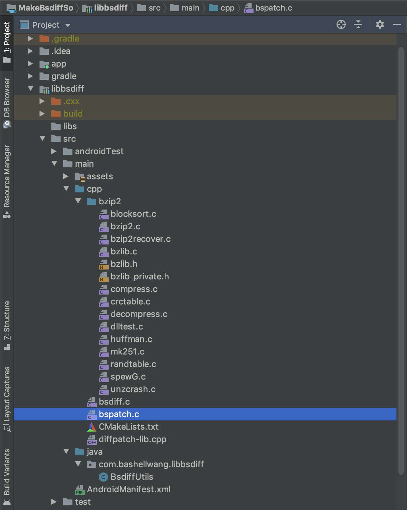
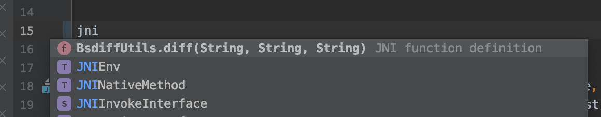
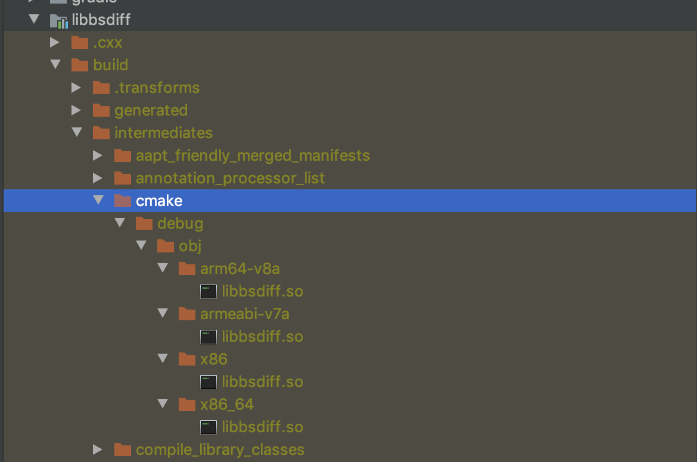

> 最近在做 web 离线包，需要使用到增量更新，这里对基于 Android Studio 编译 Bsdiff so 库做一个总结记录

web 离线包需要从服务端下载资源压缩包到本地并解压，当使用到对应资源时可以优先从本地读取，减少了网络耗时，优化了用户体验。当压缩包体积过大，或者变动量小时，如果还是整包下载，则会造成带宽流量的浪费。因此需要使用到增量更新的方式。

### 增量更新原理
增量更新就是在服务端生成新包和旧包之间的差分包，然后客户端下载这个差分包，和本地的旧包进行合并成完整包再使用。

增量更新的算法有很多，最常用的是 [bsdiff](http://www.daemonology.net/bsdiff/) 算法

<!--more-->

### 准备工作

#### bsdiff 源码下载

[bsdiff 4.3](http://www.daemonology.net/bsdiff/bsdiff-4.3.tar.gz)，它依赖 bzip2，需要下载 bzip2 源码

#### bzip2 源码下载
目前版本是 1.0.6，下载地址如下：

[bzip2-1.0.6.tar.gz](https://sourceforge.net/projects/bzip2/files/latest/download)

#### 添加 Native 代码支持

Android Studio 上安装配置 Native 代码支持，可参考 [添加 C 和 C++ 代码](https://developer.android.com/studio/projects/add-native-code)

### 代码结构

我将生成 so 的代码单独成一个子 module ，总体代码结构如图所示


#### 源码文件修改

main 下新建 cpp 目录，下面存放 bsdiff 的源码，同时新建 bzip2 目录存放对应 bzip2 源码。

> 注意：
> 
> - bsdiff.c、bspatch.c 的头文件引用路径需要修改调整为自己路径
> - bsdiff.c、bspatch.c 以及 bzip2 下的部分源码都有 main 函数入口，我们需要将他们屏蔽掉

#### 关联 CMake 文件

在 `build.gradle` 文件中关联 `cmake`，配置如下：

```
externalNativeBuild {
        cmake {
            path file('src/main/cpp/CMakeLists.txt')
        }
    }
```

更多 `cmake` 用法参考 [关联 Gradle](https://developer.android.com/studio/projects/gradle-external-native-builds)

Android Studio 同步一下，此时在 cmake 文件里则可看到对应提示帮助等。

#### 配置 CMake 文件

添加 `CMakeLists.txt` 文件，代码如下：

```
# For more information about using CMake with Android Studio, read the
# documentation: https://d.android.com/studio/projects/add-native-code.html

# Sets the minimum version of CMake required to build your native library.
# This ensures that a certain set of CMake features is available to
# your build.

cmake_minimum_required(VERSION 3.4.1)

# 查找文件系统中指定模式的路径，如/* 匹配根目录的文件（注意路径）
file(GLOB bzip2 bzip2/*.c)

# Specifies a library name, specifies whether the library is STATIC or
# SHARED, and provides relative paths to the source code. You can
# define multiple libraries by adding multiple add_library() commands,
# and CMake builds them for you. When you build your app, Gradle
# automatically packages shared libraries with your APK.

add_library( # Specifies the name of the library.
        bsdiff

        # Sets the library as a shared library.
        SHARED

        # Provides a relative path to your source file(s).
        bsdiff.c
        bspatch.c
        # 这里名字需要完全匹配，不能你是 cpp 类型文件，这里只写 .c 后缀；会有问题
        diffpatch-lib.cpp
        ${bzip2}
        )

include_directories(src/main/cpp)

find_library( # Defines the name of the path variable that stores the
        # location of the NDK library.
        log-lib

        # Specifies the name of the NDK library that
        # CMake needs to locate.
        log)

# Links your native library against one or more other native libraries.
target_link_libraries( # Specifies the target library.
        bsdiff

        # Links the log library to the target library.
        ${log-lib})
```

#### 编写 Java 层工具类

此时进入 JNI 相关内容，编写 Java 工具类方便调用 Native 代码

```
public class BsdiffUtils {
    static {
        System.loadLibrary("bsdiff");
    }

    //生成差分包
    public static native int diff(String oldFile, String newFile, String patchFile);


    public static native int patch(String oldFile, String patchFile, String newFile);
}
```
在 cpp 目录下 新建`diffpatch-lib.cpp`来实现底层 Native 方法。

在新版 AS 中(我的版本是 3.6.3)，在刚新建的 cpp 文件里输入 jni，IDE 会有提示帮助你自动生成对应的 JNI 方法声明，如图所示：



在这里我们实现差分和合并两个方法的具体实现，代码如下：

```
#include <jni.h>
#include <cstdlib>

extern "C" {
int bsdiff_main(int argc, const char *argv[]);

int bspatch_main(int argc, const char *argv[]);
}

extern "C" JNIEXPORT jint JNICALL
Java_com_bashellwang_libbsdiff_BsdiffUtils_diff(JNIEnv *env, jclass clazz, jstring old_file,
                                                jstring new_file, jstring patch_file) {

    // for cpp
    const char *oldFile = env->GetStringUTFChars(old_file, 0);
    const char *patchFile = env->GetStringUTFChars(patch_file, 0);
    const char *newFile = env->GetStringUTFChars(new_file, 0);

    const char *argv[] = {"", oldFile, newFile, patchFile};

    int result = bsdiff_main(4, argv);

    env->ReleaseStringUTFChars(old_file, oldFile);
    env->ReleaseStringUTFChars(patch_file, patchFile);
    env->ReleaseStringUTFChars(new_file, newFile);

    return result;
}

extern "C" JNIEXPORT jint JNICALL
Java_com_bashellwang_libbsdiff_BsdiffUtils_patch(JNIEnv *env, jclass clazz, jstring old_file,
                                                 jstring patch_file, jstring new_file) {

    // for cpp
    const char *oldFile = env->GetStringUTFChars(old_file, 0);
    const char *patchFile = env->GetStringUTFChars(patch_file, 0);
    const char *newFile = env->GetStringUTFChars(new_file, 0);

    const char *argv[] = {"", oldFile, newFile, patchFile};

    int result = bspatch_main(4, argv);


    env->ReleaseStringUTFChars(old_file, oldFile);
    env->ReleaseStringUTFChars(new_file, newFile);
    env->ReleaseStringUTFChars(patch_file, patchFile);

    return result;
}
```

`Rebuild Project`后可在`build->intermediates->cmake`找到对应 so 文件，其他工程可拷贝此 so 文件进行复用。也可上传到 maven 库供其他工程引用。



此时相关功能就完成了，剩下就是写测试代码验证了。

### 测试

这里主页面有两个按钮，一个是差分按钮，一个是合并按钮，分别调用差分和合并功能。

#### 差分

- 在电脑上安装 bsdiff 命令工具，进行差分获取 patch 包并计算 md5 值
- 在手机中调用 so 库进行差分得到 patch 包，并计算 md5 值
- 比较两个 md5 是否一致

#### 合并
- 合并后得到新包计算 md5 值
- 与差分前的完整包做 md5 比对

### 总结

本文基于 Android Studio 和 Cmake ，搭建 NDK 环境并编译成功 bsdiff so 库，并进行测试验证。后续有需要可直接使用

### 源码

[GitHub 地址](https://github.com/bashellwang/MakeBsdiffSo)