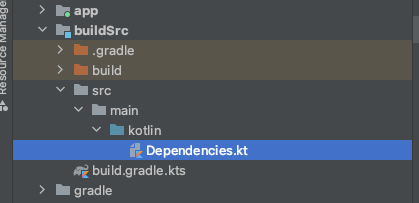
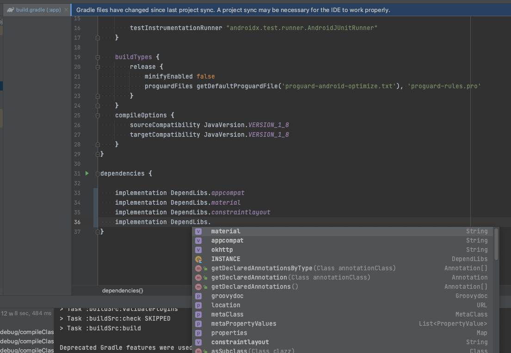
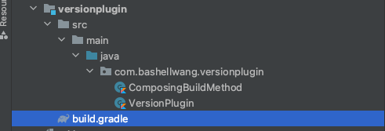

### 背景
随着项目的发展扩张，项目区分多个 module 的做法越来越常见，同时项目中的依赖也越来越多，不同 module 引入的版本也不一致。有必要对项目中的依赖做梳理，达到统一管理、单独配置，版本号统一的目的。

### gradle 依赖管理的一些方案
gradle 随着版本的发展，也不断涌现出一些不同的方案。包括：`原始手动管理`、`extra 扩展管理`、`buildSrc 方案`、`composing build` 方案以及 gradle 7.0 新出的 `version catalog` 等。

<!--more-->

#### 原始手动管理
手动管理的方式如下所示，自己引入需要的库，该方法最直观简单，但是在每次升级依赖库时需要做大量手动修改调整；同时不同 module 中容易存在重复的配置，且不容易管理版本更新。

```
dependencies {
    implementation 'androidx.appcompat:appcompat:1.3.1'
    implementation 'com.google.android.material:material:1.4.0'
    implementation 'androidx.constraintlayout:constraintlayout:2.1.1'
    implementation 'com.squareup.okhttp3:okhttp:4.9.2'
}
```

#### google 推荐，使用 extra 扩展
google 在[配置项目全局属性](https://developer.android.com/studio/build/gradle-tips#configure-project-wide-properties) 中推荐这种管理方式。

在根目录下`build.gradle`中，添加`ext`代码块

```
ext {
    appcompatVer = "1.3.1"
    materialVer = "1.4.0"
    constraintlayoutVer = "2.1.1"
    okhttpVer = "4.9.2"

    dependencies = [
            appcompat       : "androidx.appcompat:appcompat:$appcompatVer",
            material        : "com.google.android.material:material:$materialVer",
            constraintlayout: "androidx.constraintlayout:constraintlayout:$constraintlayoutVer",
            okhttp          : "com.squareup.okhttp3:okhttp:$okhttpVer"
    ]
}
```

在 module 目录下 `build.gradle` 中引入使用

```
dependencies {
    implementation rootProject.ext.dependencies.appcompat
    implementation rootProject.ext.dependencies.material
    implementation rootProject.ext.dependencies.constraintlayout
    implementation rootProject.ext.dependencies.okhttp
}
```
这种方法比手动管理好了很多，可以做到统一版本号，统一管理；但是他也有缺点，就是在 IDE 中无法关联自动补全，同时 ext 里依赖项太多时，这个文件会变得很长。可以参考 [使用循环优化Gradle依赖管理](https://juejin.cn/post/6947675376835362846#heading-2) 处理。

#### buildSrc + Kotlin
上面介绍的方法，不支持代码提示，不支持 IDE 跳转，在多模块开发时相同的依赖需要复制粘贴，使用 buildSrc +Kotlin 可以解决这个问题。
> gradle 在运行时会去检查是否存在 buildSrc 的目录，如果有的话，gradle 会自动编译并测试这段代码，并将其放入构建脚本的路径中。对于多项目构建，只能有一个 buildSrc 目录，它位于 gradle 根目录下的一个目录。


##### 根目录下创建 buildSrc 目录



##### 新建文件 build.gradle.kts
文件内容如下，同步 gradle

```
plugins {
    `kotlin-dsl`
}
repositories {
    // 必不可少
    jcenter()
}
```

##### 创建 /src/main/kotlin/Dependencies.kt
文件内容如下

```
object Versions {
    const val appcompatVer = "1.3.1"
    const val materialVer = "1.4.0"
    const val constraintlayoutVer = "2.1.1"
    const val okhttpVer = "4.9.2"
}

object DependLibs {
    const val appcompat = "androidx.appcompat:appcompat:${Versions.appcompatVer}"
    const val material = "com.google.android.material:material:${Versions.materialVer}"
    const val constraintlayout = "androidx.constraintlayout:constraintlayout:${Versions.constraintlayoutVer}"
    const val okhttp = "com.squareup.okhttp3:okhttp:${Versions.okhttpVer}"
}
```

在 module 中的 `build.gradle` 中引用，如下所示。

```
dependencies {
    implementation DependLibs.appcompat
    implementation DependLibs.material
    implementation DependLibs.constraintlayout
    implementation DependLibs.okhttp
}
```
代码支持跳转，也可以支持自动补全，如下图所示




#### Composing build

buildSrc 在依赖更新时会重新构建整个项目，是对全局所有 module 的配置，因此构建速度较慢；有没有既满足自动补全、单击跳转又在依赖更新时不重新构建整个项目的方法呢。答案是使用 [Composing Build](https://docs.gradle.org/current/userguide/composite_builds.html#composite_build_intro)

> `Composing build`又称 `复合构建`，指的是包含其它构建的构建。有点类似于 gradle 多项目构建，不同于独立项目，它是包含包括`settings.gradle`等配置文件在内的整个完整项目构建。
> 
> 包含在复合构建中的构建被称为`包含构建`，包含的构建不与复合构建或其他包含的构建共享任何配置。每个包含的构建都是独立配置和执行的。
> 

新建一个 module，只保留 src/main 下代码源文件和 build.gradle 文件，其余均删除，如图所示：


其中 VersionPlugin 为继承 Plugin 的实现类，代码空实现即可

```
class VersionPlugin : Plugin<Project> {
    override fun apply(target: Project) {

    }
}
```

ComposingBuildMethod.kt 为定义依赖版本信息类，代码如下：

```
class ComposingBuildMethod {
    object Versions {
        const val appcompatVer = "1.3.1"
        const val materialVer = "1.4.0"
        const val constraintlayoutVer = "2.1.1"
        const val okhttpVer = "4.9.2"
    }

    object DependLibs {
        const val appcompat = "androidx.appcompat:appcompat:${Versions.appcompatVer}"
        const val material = "com.google.android.material:material:${Versions.materialVer}"
        const val constraintlayout =
            "androidx.constraintlayout:constraintlayout:${Versions.constraintlayoutVer}"
        const val okhttp = "com.squareup.okhttp3:okhttp:${Versions.okhttpVer}"
    }
}
```
最后，build.gradle 中修改如下所示：

```
buildscript {
    repositories {
        jcenter()
    }
    dependencies {
        // 因为使用的 Kotlin 需要需要添加 Kotlin 插件
        classpath "org.jetbrains.kotlin:kotlin-gradle-plugin:1.3.72"
    }
}

apply plugin: 'kotlin'
apply plugin: 'java-gradle-plugin'

repositories {
    // 需要添加 jcenter 否则会提示找不到 gradlePlugin
    jcenter()
}

dependencies {
    implementation gradleApi()
    implementation "org.jetbrains.kotlin:kotlin-stdlib-jdk8:1.3.72"

}

compileKotlin {
    kotlinOptions {
        jvmTarget = "1.8"
    }
}
compileTestKotlin {
    kotlinOptions {
        jvmTarget = "1.8"
    }
}

gradlePlugin {
    plugins {
        version {
            // 在 app 模块需要通过 id 引用这个插件
            id = 'com.bashellwang.versionplugin'
            // 实现这个插件的类的路径
            implementationClass = 'com.bashellwang.versionplugin.VersionPlugin'
        }
    }
}
```
然后，在 setting.gradle 中使用 `includeBuild` 引用该 module。

```
includeBuild 'versionplugin'
```
最终在需要使用的 module，即 app module 下的 build.gradle 中引用该插件并使用即可。

```
plugins {
    id 'com.bashellwang.versionplugin'
}
...
dependencies{
    // composing build 引用
    implementation ComposingBuildMethod.DependLibs.appcompat
    implementation ComposingBuildMethod.DependLibs.material
    implementation ComposingBuildMethod.DependLibs.constraintlayout
    implementation ComposingBuildMethod.DependLibs.okhttp
}

```


#### Version Catalogs
官方在 Gradle7.0 推出了一个新特性，可以使用 [Catalog](https://docs.gradle.org/current/userguide/platforms.html#sec:sharing-catalogs) 统一依赖版本，它有以下特点：

- 对于每一个 catalog，gradle 可以生成类型安全的访问器方便在 IDE 中自动补全(注：实测在 build.gradle 中暂未实现，不确定是用法问题还是功能开发中)
- catalog 对所有 module 可见，可以方便统一管理版本依赖
- catalog 可以声明 bundles 依赖，就是经常一起使用的依赖的组合
- catalog 支持依赖版本号与版本名分割，使用 version refrerences 可以在不同依赖之间共享版本号

因为 catalog 还是一个在孵化中的功能，因此要使用时需要在 setting.gradle 中开启功能预览

```
enableFeaturePreview('VERSION_CATALOGS')
```
然后新建一个 toml 文件，里面是一些版本依赖相关信息，比如：

```
[versions]
groovy = "3.0.5"
checkstyle = "8.37"
compilesdk = "30"
targetsdk = "30"

[libraries]
retrofit = "com.squareup.retrofit2:retrofit:2.9.0"
groovy-core = { module = "org.codehaus.groovy:groovy", version.ref = "groovy" }
groovy-json = { module = "org.codehaus.groovy:groovy-json", version.ref = "groovy" }
groovy-nio = { module = "org.codehaus.groovy:groovy-nio", version.ref = "groovy" }
commons-lang3 = { group = "org.apache.commons", name = "commons-lang3", version = { strictly = "[3.8, 4.0[", prefer="3.9" } }

[bundles]
groovy = ["groovy-core", "groovy-json", "groovy-nio"]
```
之后在 setting.gradle 中进行声明后即可使用：

```
dependencyResolutionManagement {
    versionCatalogs {
        cataloglibs {
            from(files("libs.versions.toml"))
        }
    }
}
```
在 app 下的 build.gradle 文件中使用

```
// gradle catalog 引用
implementation cataloglibs.retrofit
implementation cataloglibs.groovy.core
implementation cataloglibs.groovy.json
implementation cataloglibs.groovy.nio
```

#### 源码地址
[GitHub](https://github.com/bashellwang/gradlestudy)

### 总结
本文对常见依赖管理的几种方式进行了总结梳理，并初步体验了 gradle 7.0 新出的版本管理方式 catalog，项目可根据实际情况选择使用。

### 参考

- [Android 官方文档](https://developer.android.com/studio/build/gradle-tips#configure-project-wide-properties)
- [Composing builds](https://docs.gradle.org/current/userguide/composite_builds.html)
- [Android 重构 ｜ 持续优化统一管理 Gradle](https://juejin.cn/post/6872721978898743310#heading-11)
- [7个你应该知道的Gradle实用技巧](https://juejin.cn/post/6947675376835362846#heading-2)
- [【奇技淫巧】除了 buildSrc 还能这样统一配置依赖版本？巧用 includeBuild](https://juejin.cn/post/6844904169833234439)
- [【Gradle7.0】依赖统一管理的全新方式，了解一下~](https://juejin.cn/post/6997396071055900680)
- [Gradle Release Notes](https://docs.gradle.org/7.0/release-notes.html)
- [Sharing dependency versions between projects](https://docs.gradle.org/current/userguide/platforms.html)