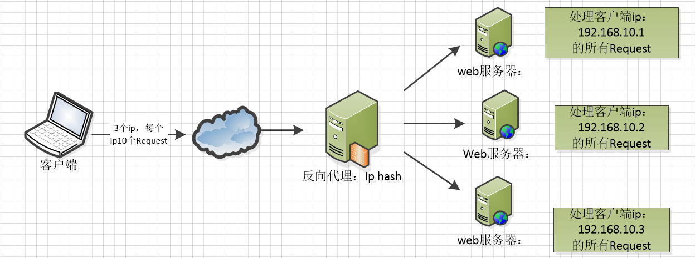

> 前端代码在部署发布过程中，需要涉及到服务器的配置处理，一般都是运维或发布同事帮忙处理，目前公司主要使用的是 Nginx 服务器。了解一些 Nginx 的知识，有利于我们快速定位处理一些发布中遇到的问题。

### 基础概念说明

#### Nginx
[Nginx](https://www.nginx.com/resources/wiki/) 是一个免费的、开源的、高性能的 HTTP 服务器，同时也是反向代理服务器，以及 IMAP/POP3 代理服务器。Nginx 以其高性能、稳定性、丰富功能集、简单的配置和低资源消耗而著称。可以通过简单配置来实现反向代理、负载均衡、Nginx 缓存以及动静分离等功能。

<!-- more -->
#### 正向代理和反向代理
* `正向代理`：是一个位于客户端和原始服务器(origin server)之间的服务器，为了从原始服务器取得内容，客户端向代理发送一个请求并指定目标(原始服务器)，然后代理向原始服务器转交请求并将获得的内容返回给客户端。
* `反向代理`：反向代理服务器位于用户与目标服务器之间，但是对于用户而言，反向代理服务器就相当于目标服务器，即用户直接访问反向代理服务器就可以获得目标服务器的资源。同时，用户不需要知道目标服务器的地址，也无须在用户端作任何设定。

正向代理服务器和反向代理服务器都是位于客户端和真实服务器之间，所做的事情也都是把客户端请求转发到服务器，再把服务器响应转发回客户端。两者还是有一定的差异。

1. 正向代理是客户端的代理，可以帮助客户端访问其无法访问的服务器资源。反向代理则是服务器的代理，帮助服务器做负载均衡，安全防护等。
2. 正向代理一般是客户端架设的，比如在自己机器安装一个代理软件。而反向代理一般是服务器架设的，比如在机器集群中部署一个反向代理服务器。
3. 正向代理中，服务器不知道真正的客户端是谁，以为访问自己的就是真实的客户端。而在反向代理中，客户端不知道真正的服务器是谁，以为自己访问的是真实的服务器。
4. 正向代理和反向代理的作用和目的不一样。正向代理主要是用来解决访问限制问题。而反向代理则是提供负载均衡、安全防护等作用。二者均能提高访问速度。

总的来说，正向代理是模拟客户端，对客户端负责；反向代理是模拟服务器，对所代理的服务器负责。

示意图可参考如下图所示：


#### 负载均衡
`负载均衡`，英文名称为 Load Balance，其含义就是指将负载（工作任务）进行平衡、分摊到多个操作单元上进行运行，例如 FTP服务器、Web 服务器、企业核心应用服务器和其它主要任务服务器等，从而协同完成工作任务。

负载均衡构建在原有网络结构之上，它提供了一种透明且廉价有效的方法扩展服务器和网络设备的带宽、加强网络数据处理能力、增加吞吐量、提高网络的可用性和灵活性。

负载均衡常用算法

* `轮询/加权轮询`：每个请求按时间顺序逐一分配到不同的后端服务器，如果后端某台服务器宕机，故障系统被自动剔除，使用户访问不受影响。Weight 指定轮询权值，Weight 值越大，分配到的访问机率越高，主要用于后端每个服务器性能不均的情况下。
* `IP 哈希`：每个请求按访问 IP 的 hash 结果分配，这样来自同一个 IP 的访客固定访问一个后端服务器，有效解决了动态网页存在的 session 不共享问题。
* `最小连接法`：将任务分配给此时具有最小连接数的节点，因此它是动态负载均衡算法。一个节点收到一个任务后连接数就会加1，当节点故障时就将节点权值设置为0，不再给节点分配任务。适用于各节点性能相似时。
* `URL 哈希`：根据请求的 URL 的哈希值来分配服务器。它的特点是相同 URL的请求会分配给固定的服务器，当存在缓存时，效率较高。

Nginx 内置策略为轮询、加权轮询和 IP 哈希。示意图如下所示：




### Nginx 基础

#### Nginx 安装

1. 下载 [Nginx](http://nginx.org/en/download.html) 版本
2. 解压 nginx-xx.tar.gz 包
3. 进入解压缩目录，执行 `./configure`
4. 执行命令 `make & make install`

如若安装结束，使用 `nginx` 启动 nginx 后，浏览器中输入 `http:localhost` 看到欢迎页面即可验证安装启动成功。

#### Nginx 常用命令


```
nginx -h：查看帮助
nginx -v：查看版本信息
nginx -V：查看版本和配置信息
nginx -t：测试配置文件正确性
nginx -T：测试配置文件，并显示配置文件信息
nginx -q：测试配置文件，但是只显示错误信息
nginx -s：发送信号，包括：stop、quit、reopen、reload
nginx -p：设置前缀
nginx -e：设置错误日志文件路径
nginx -c：设置配置文件
nginx -g：设置配置文件路径
```

#### Nginx 模块化机制

Nginx 的内部结构是由核心部分和一系列的功能模块所组成。这样划分是为了使得每个模块的功能相对简单，便于开发，同时也便于对系统进行功能扩展。

* 第一类模块叫 `ngx_core_module` 叫核心模块。核心模块里面会有一类核心模块，比如 events，http，mail 或者 stream。它们本身会定义出新的类型模块，如果新出了一类应用可以新增一个 `ngx_core_module` 来定义新的模块。
* 还有个独立的模块叫 `ngx_conf_module`，这个类型只有一个模块叫 `ngx_conf_module`；它只负责去解析我们的 nginx.conf 文件。
* 所有事件处理的方法内聚为 `ngx_event_module` 事件模块。通常会在这类模块中其中第一个模块通常加上 `_core` 关键字来把通用的共性部分放到里面，比如 `event_core`，`ngx_http_core_module`，`ngx_mail_core_module`，`ngx_stream_core_module`。
* 其次最复杂的 http 模块。`ngx_http_core_module` 它已经定义了许多特色的规则。比如说当一个 http 请求进入 nginx 的时候，为请求生成相应的模块我们叫它请求处理模块；当我们生成响应把响应发送给浏览器的时候，响应过滤模块会对响应做二次处理；还有一类模块叫 upsteam 相关模块，它专注于在一个请求内部去访问上游服务。

示意图如图所示：


### Nginx 配置文件

#### 配置文件说明

Nginx 的主配置文件是 `nginx.conf`，这个配置文件一共由三部分组成，分别为 `全局块、events 块和 http 块`。

* 全局块：配置影响 nginx 全局的指令。一般有运行 nginx 服务器的用户组，nginx 进程 pid 存放路径，日志存放路径，配置文件引入，允许生成 worker process 数等。
* events 块：配置影响 nginx 服务器或与用户的网络连接。有每个进程的最大连接数，选取哪种事件驱动模型处理连接请求，是否允许同时接受多个网路连接，开启多个网络连接序列化等。
* http 块：可以嵌套多个 server，配置代理，缓存，日志定义等绝大多数功能和第三方模块的配置。如文件引入，mime-type 定义，日志自定义，是否使用 sendfile 传输文件，连接超时时间，单连接请求数等。
* server 块：配置虚拟主机的相关参数，一个http中可以有多个server。
* location 块：配置请求的路由，以及各种页面的处理情况。

```
#全局块
#user  nobody;
worker_processes  1;

#event块
events {
    worker_connections  1024;
}

#http块
http {
    #http 全局块
    include       mime.types;
    default_type  application/octet-stream;
    sendfile        on;
    keepalive_timeout  65;
    #server块
    server {
        #server 全局块
        listen       8000;
        server_name  localhost;
        #location 块
        location / {
            root   html;
            index  index.html index.htm;
        }
        error_page   500 502 503 504  /50x.html;
        location = /50x.html {
            root   html;
        }
    }
    #这边可以有多个 server 块
    server {
      ...
    }
}
```
更多详情可参考：[Nginx配置文件详解](https://www.cnblogs.com/54chensongxia/p/12938929.html)

#### location 详解

location 指令是 nginx 中最重要的指令之一，它用来匹配不同的 url 请求，进而对请求做不同的处理和响应，其中重点需要注意的是 location 的匹配顺序及优先级。

##### location 语法
```
# 关键字 修饰符 匹配的前缀字符(url){ 要执行的操作 }

location [=|~|~*|^~] /uri/ { … }
location @name { ... }
```

##### location 模式及匹配优先级
|名字|模式|含义|
|----|----|----|
| 精确匹配 | locatio = /uri | = 表示精确匹配，只有完全匹配上才能生效 |
| 前缀匹配 | location ^~ /uri | ^~ 开头对URL路径进行前缀匹配，并且在正则之前。|
| 正则匹配 | location ~ pattern | 开头表示区分大小写的正则匹配 |
| 正则匹配 | location ~* pattern | 开头表示不区分大小写的正则匹配 |
| 最长前缀匹配 | location /uri | 不带任何修饰符，也表示前缀匹配，但是在正则匹配之后 |
| 默认匹配 | location / | 通用匹配，任何未匹配到其它location的请求都会匹配到，相当于switch中的default |

多个 location 配置的情况下匹配顺序为:

* location = /a {…} #精准匹配
* location ^~ /a {…} #前缀匹配
* location ~ /a.* {…} #正则匹配（区分大小写）
* location ~* /a.* {…} #正则匹配（不区分大小写）
* location /a {…} #最长前缀匹配，但是优先级低于正则匹配。 /a 和 ^~ /a 会冲突，报错
* location / {} #任何没有匹配成功的，都会匹配这里处理

##### 命名 location @name 用法
@用来定一个一个命名 location。主要用于内部重定向，不能用来处理正常的请求。

```
location / {
	try_files $uri $uri/ @custom
}

location @custom {
	# do ... something
}
```

##### uri 末尾带不带 / 的说明

uri 末尾带斜杠`/user/`表示目录，不带斜杠`/user`表示文件。

默认情况下，访问 `/user/`时，服务器会自动去该目录下查找加载默认文件。
而访问 `/user` 时，服务器会先尝试加载该文件，如果文件不存在，则重定向至 `/user/` 去该目录下找默认文件。


### OpenResty
[OpenResty](https://openresty.org/cn/) 是一个基于 Nginx 与 Lua 的高性能 Web 平台，其内部集成了大量精良的 Lua 库、第三方模块以及大多数的依赖项。用于方便地搭建能够处理超高并发、扩展性极高的动态 Web 应用、Web 服务和动态网关。

通过 OpenResty，Web 开发人员和系统工程师可以使用 Lua 脚本语言调动 Nginx 支持的各种 C 以及 Lua 模块。

#### Lua 入门
我们学习 OpenResty，只需要了解基础 lua 语法即可，下面列举出一些和其他常见语言不太一样的地方，方便快速对比上手。更多详情可自行参考网络资料 [Lua 教程](https://www.runoob.com/lua/lua-tutorial.html)。

```
-- 单行注释

--[[
	这是一个
	多行注释
--]]

-- Lua 中的表（table）其实是一个"关联数组"（associative arrays），数组的索引可以是数字或者是字符串。
-- Lua 中表的默认初始索引一般从 1 开始。
-- 创建一个空的 table
local tbl1 = {}
 
-- 直接初始表
local tbl2 = {"apple", "pear", "orange", "grape"}

--[[
	Lua 中变量有三种：全局变量、局部变量、表中的域
	Lua 中的变量全是全局变量，哪怕是语句块或是函数里，除非用 local 显式声明为局部变量。
	局部变量的作用域为从声明位置开始到所在语句块结束。
--]]

-- Lua 函数可以接受可变数目的参数，和 C 语言类似，在函数参数列表中使用三点 ... 表示函数有可变的参数。
function add(...)  
local s = 0  
  for i, v in ipairs{...} do   --> {...} 表示一个由所有变长参数构成的数组  
    s = s + v  
  end  
  return s  
end  
print(add(3,4,5,6,7))  --->25

-- 运算符: .. 和 #
a = "hello "
b = "world"

print("连接字符串 a 和 b ", a..b )
print("b 字符串长度 ",#b )
```

#### OpenResty 安装
以 Mac 为例，使用 `brew` 安装

```
brew install openresty/brew/openresty
```
安装后，将 `/usr/local/Cellar/openresty/<version>/bin` 和 `/usr/local/Cellar/openresty/<version>/nginx/sbin` 配置到系统 path 环境变量中。使用 `openresty -v` 来查看版本信息。

#### HelloWorld
新建一个工作目录 `hello_resty`，里面新建两个目录 `conf` 和 `logs`。在 conf 目录下新建配置文件 `nginx.conf`，文件内容如下：

```
worker_processes  1;        #nginx worker 数量
error_log logs/error.log debug;   #指定错误日志文件路径
events {
    worker_connections 1024;
}

http {
    server {
        listen 8080;
        location / {
            default_type text/html;
            content_by_lua_block {
                ngx.say("<h2>hello</h2>")
            }
        }
    }
}
```
启动 nginx

```
nginx -p ./ -c conf/nginx.conf
```
启动后可以使用 `curl http://localhost:6699` 访问，使用浏览器访问 `http://localhost:8080/` 有同样效果。

#### nginx lua 模块
OpenResty 处理请求流程如下：


由于 Nginx 把一个请求分成了很多阶段，这样第三方模块就可以根据自己行为，挂载到不同阶段进行处理达到目的。OpenResty 也应用了同样的特性。所不同的是，OpenResty 挂载的是我们编写的 Lua 代码。

* `set_by_lua*`: 流程分支处理判断变量初始化
* `rewrite_by_lua*`: 转发、重定向、缓存等功能(例如特定请求代理到外网)
* `access_by_lua*`: IP 准入、接口权限等情况集中处理(例如配合 iptable 完成简单防火墙)
* `content_by_lua*`: 内容生成
* `header_filter_by_lua*`: 响应头部过滤处理(例如添加头部信息)
* `body_filter_by_lua*`: 响应体过滤处理(例如完成应答内容统一成大写)
* `log_by_lua*`: 会话完成后本地异步完成日志记录(日志可以记录在本地，还可以同步到其他机器)

把逻辑放在不同阶段，分工明确，代码独立，方便维护以及扩展。

### Demo 案例
#### 需求
实现一个静态代码网站，同一 url 请求，PC 和 移动端均可访问。根据请求方携带的 useragent 判断来源，从而导向不同页面。同时可以在链接里带上指定参数来访问指定页面。

#### nginx 配置文件实现

```
location ~ ^/(hello$|hello/) {

            access_by_lua_block     {
                local uri_args = ngx.req.get_uri_args()   
                ngx.log(ngx.DEBUG,string.format("匹配正则表达式, uri_args: %s",table.concat(uri_args,',')))

                if uri_args["__mobile__"] ~= nil then
                    -- Forward requests containing __mobile__ parameter to mobile.
                    uri_args["__mobile__"] = nil
                    ngx.req.set_uri_args(uri_args)
                    ngx.log(ngx.DEBUG,string.format("有参数:__mobile__, 走移动端"))
                    return ngx.exec("/hello-mobile/index.html")
                elseif uri_args["__pc__"] ~= nil then
                    -- Forward requests containing __pc__ parameter to pc.
                    uri_args["__pc__"] = nil
                    ngx.req.set_uri_args(uri_args)
                    ngx.log(ngx.DEBUG,string.format("有参数:__pc__, 走PC端"))
                    return ngx.exec("/hello-pc/index.html")
                end

                if ngx.var.http_user_agent then
                     ngx.log(ngx.DEBUG,string.format("请求方带有 useragent，检查useragent"))
                    -- Forward PC (non-app) requests to hello-pc.

                    if(string.find(ngx.var.http_user_agent, "Windows NT") or
                        string.find(ngx.var.http_user_agent, "Macintosh") or
                        string.find(ngx.var.http_user_agent, "iPad") or
                        string.find(ngx.var.http_user_agent, "SM%-T") or
                        string.find(ngx.var.http_user_agent, "SM%-P") or
                        string.find(ngx.var.http_user_agent, "X11") ) then

                        ngx.log(ngx.DEBUG,string.format("不是移动端，走PC页面"))
                        return ngx.exec("/hello-pc/index.html")

                    else
                    -- Forward mobile (non-app) requests to mobile.
                        ngx.log(ngx.DEBUG,string.format("默认走移动端页面"))
                        return ngx.exec("/hello-mobile/index.html")
                    end

                end
                ngx.log(ngx.DEBUG,string.format("兜底处理，去首页"))
                return ngx.exec("/home.html")
            }
        }
``` 

#### 效果演示
模拟 PC 端访问效果


模拟移动端访问效果


### 总结
本文以学习入门 nginx 配置为目的，介绍了相关涉及到的概念和基础知识，包括 nginx、反向代理、负载均衡相关知识、lua基础、 openresty 基础等，最后给出一个 demo 样例用于展示。

所涉及到的东西都是基础部分，没有深入说明，目的是给出 nginx 配置涉及的相关知识面，使我们对其有一个相对基础而全面的了解，后续有需要深入的部分可以知道从哪个方向去着手解决。

### 参考资料
1. [Nginx 配置详解](https://www.runoob.com/w3cnote/nginx-setup-intro.html)
2. [反向代理](https://baike.baidu.com/item/%E5%8F%8D%E5%90%91%E4%BB%A3%E7%90%86)
3. [负载均衡](https://baike.baidu.com/item/%E8%B4%9F%E8%BD%BD%E5%9D%87%E8%A1%A1/932451)
4. [What Is Load Balancing?](https://www.nginx.com/resources/glossary/load-balancing/)
5. [Nginx 模块分类](https://www.cnblogs.com/pizixu/articles/12455407.html)
6. [OpenResty 最佳实践](https://moonbingbing.gitbooks.io/openresty-best-practices/content/)
7. [Nginx配置文件详解](https://www.cnblogs.com/54chensongxia/p/12938929.html)
8. [nginx location 详解](https://www.fandenggui.com/post/nginx-location.html)
9. [Lua 教程](https://www.runoob.com/lua/lua-tutorial.html)
